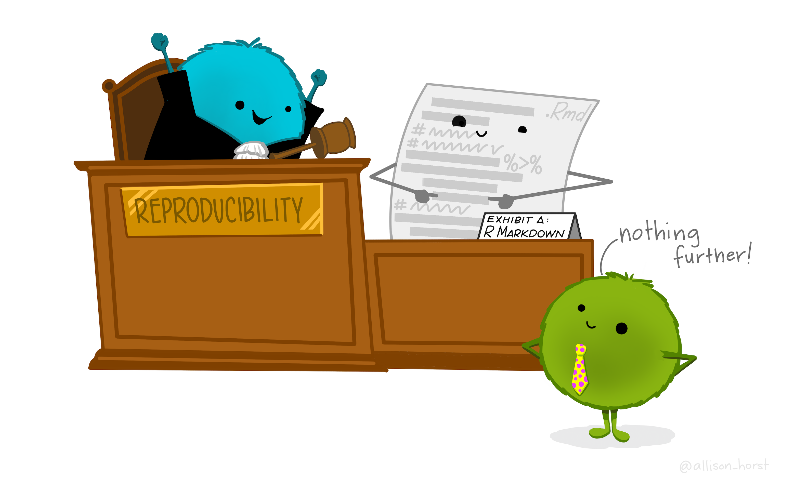

```{r setup, include=FALSE}
knitr::opts_chunk$set(echo = TRUE)
```

```{r, echo = FALSE}

```

## 1. Meet R all on its own

### ...because you should just do it one time.

Open R (outside of RStudio) once just to see what it looks like. It's very likely that you will never open R on its own again...but there *are* people who work entirely in the basic R interpreter and minimal environment.

Now you've seen it. Close it - from now on, you'll open RStudio (which opens R along with it). RStudio is an incredibly awesome and user-friendly **integrated development environment** (IDE). An IDE provides a place for data scientists to see and work with a bunch of different aspects of their work in a nice, organized interface. 

Always remember: **R is the programming language. RStudio is the IDE.**
    
## 2. Meet RStudio

RStudio provides a nice user interface for data science, development, reporting, and collaboration (all of which you'll learn about throughout the MEDS program) in one place. Note that while it's called **R**Studio, it is a useful IDE for development in a number of languages and file types (check out some by clicking on File > New File, and seeing the multitude of options that RStudio suggests). 

Let's take a quick tour of the RStudio IDE, then customize it for fun and functionality. 

- Major panes
- Update your theme
    - Tools > Global Options
- Update some important settings
    - Theme: Appearance (pick a theme & editor font)
    - Code: Display > rainbow parentheses
    - Code wrapping: Editing > Soft wrap R source files (CHECK)
    - General: Workspace > Save workspace to .Rdata on exit? Choose NEVER.
        
## 3. Basic calculations in the Console

- Working in the Console, each line run every time you press 'Enter'
- Use expected operators (*, /, +, -, ^) in calculations
- Other operations use functions, e.g. `sqrt()`, `log()` for the natural log, etc.
- What is a function? What are the pieces?
- See the R documentation about a function using `?function_name` in the Console, for example try running `?log`
- Use `<-` to store an object (see it appear in the Environment tab)
- Create & store a few variables to values
- Create a function (with shortcut Cmd + Shift + X) and use it a few times
- Now go to Session > Restart R...are your objects still there? NOPE. 
    
## 4. Introduction to Quarto

Quarto is a publishing framework that lets you make all kinds of things (dashboards, websites, notebooks, slides, books, etc.) that combine markdown (plain text with added formatting), code, and outputs in one place - which makes it an incredible tool for reproducibility. Let's make a Quarto document (File > Quarto document) and learn by doing. 

In your new Quarto document, let's add:

- Some text formatting
  - Headers (with different numbers of pound signs to start the line)
  - Bulletpoints (asterisks or dashes to start lines)
  - Links (`[text here!](link here)`)
  - **Bold** (double asterisk) & *italics* (single asterisk)
- Code chunks (shortcut: Cmd + Option + I)
- Outputs (run code with Cmd + Enter, or buttons)
- Knitting: When you *render* an Quarto document, all content is first converted to plain markdown, then converted to a file output type you select (the default, and the one we'll use most often is HTML)
    
## 5. Our first function

We'll get into the weeds of functions in EDS 221. For now, we'll create functions to quickly do repeated calculations, and to familiarize ourselves with function notation.  

General function notation looks like this: 

```
function_name <- function(argument_1, argument_2) {

  function_body

}
 ```
 
For example, let's make a function to help us convert units of $\frac{g}{cm^3}$ to $\frac{kg}{ft^3}$, given that $1 cm^3 = 3.531\times10^{-5}ft^3$

First, we should write down the dimensional analysis to keep our conversion straight (this is worth writing out by hand, every time):

$$\frac{g}{cm^3}*\frac{1 kg}{1000 g}*\frac{1cm^3}{3.531\times10^{-5}ft^3}$$

Let's make a function that will convert any value input in $\frac{g}{cm^3}$ to $\frac{kg}{ft^3}$:

```{r}
convert_units <- function(value_g_cm3) {
  value_kg_ft3 = value_g_cm3 * (1 / 1000) * (1 / 3.531e-5)
  print(value_kg_ft3)
}
```

Try it out! 

Convert $50\frac{g}{cm^3}$ to $\frac{kg}{ft^3}$ using the function you've created. 

## 6. Close & reopen - no precious outputs or objects

If you are writing code reproducibly, you should be able to close the file you're working it without stress. That's because all of your stored objects - functions, variables, etc. - should be recreated by opening and re-running the code in your file. If you *cannot* do that, then your code is not reproducible. 

That means that **your scripted code is what is precious** - and we want to build bomb-proof strategies for making sure it's safe. 

Which brings us to a critical lesson: Create things like you expect your computer to explode at any minute. Your computer is NOT a safe place. Where is? Someone away from your local computer...somewhere cloudlike and wonderful. Somewhere like GitHub (coming up soon!). 

## End interactive session 1a

