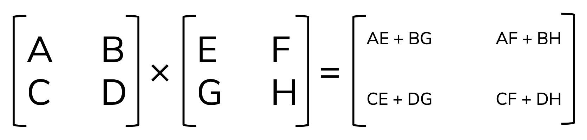
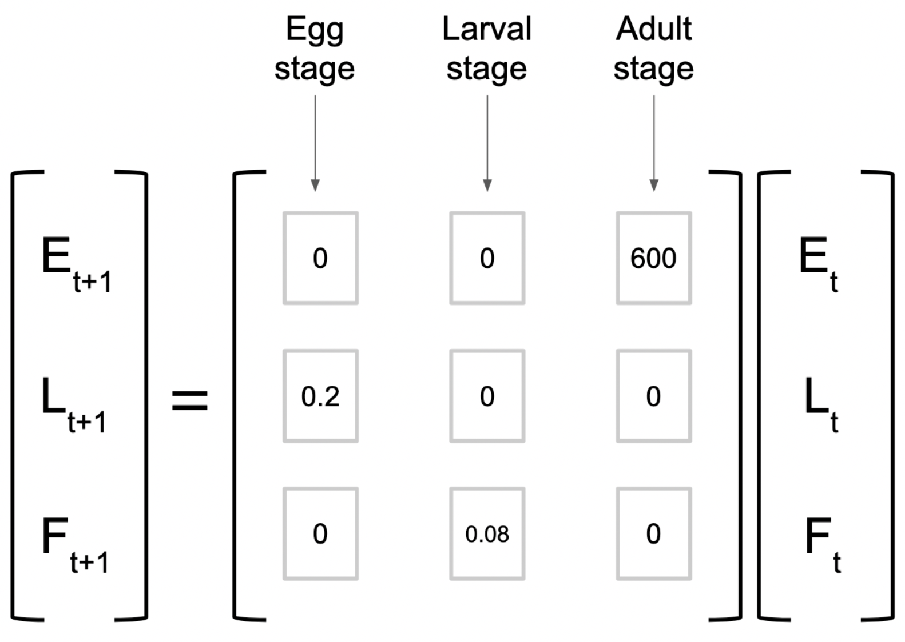

In this lesson, we'll learn about making & working with scalars, vectors and matrices in R and Python. We'll be working in both an R Markdown and Jupyter Notebook. 

```{r, include = FALSE}
library(reticulate)
```


## Set up

- Create a new repository on GitHub called `eds212-comp-4a`, with a ReadMe
- Clone and create a new version-controlled R Project
- Add a new R Markdown document
- Open Anaconda Navigator, launch Jupyter Notebook, navigate to the Project folder you just created, & a new Jupyter Notebook there (when you save your Jupyter NB, make sure it's saving *in your R project*)

## Vectors

### Reminder: Vectors in R

```{r}
ringtail <- c(4.3, 8.9, 2.6, 7.1)
fox <- c(9.0, 12.5, 5.4, 10.9)

# Addition:
ringtail + fox

# Subtraction: 
fox - ringtail

# Scalar multiplier: 
100 * ringtail

# Dot product: 
ringtail %*% fox

```


### Vectors in Python (basics)

Over in your Jupyter notebook, add a header. 

In a new code chunk, import the `numpy` package (it's already installed along with Anaconda) 

```{python}
import numpy as np
```

To make a vector, create a *list* (more on this in EDS 221) then convert to an array (with a single column = vector):

```{python}
# First make it a list of values (we'll learn more about lists in 221)
list_1 = [1,2,3]

# Make it a vector using np.array:
vec_1 = np.array(list_1)

# Return vec_1 to check it out
vec_1
```

Cool! Let's make another one so we can try some math: 

```{python}
list_2 = [10, 100, 1000]
vec_2 = np.array(list_2)
vec_2
```

Now we can do some math with our two vectors (`vec_1` and `vec_2`):

```{python}
# Addition:
vec_1 + vec_2

# Subtraction: 
vec_2 - vec_1

# Scalar multiplier: 
5 * vec_2
```

**BEWARE:** If you do these operations with the original *lists*, something very different will happen, since the `+` with lists appends the second list elements to the first list. Let's try it just for comparison: 

```{python}
list_1 + list_2
```

For the dot product, use `np.dot()`:
```{python}
np.dot(vec_1, vec_2)
```

## Matrices

### Matrices in R

A matrix contains data of a single class (usually numbers). Which means that we can think of the contents of a matrix as a single sequence of values, that are constrained (wrapped) to the specified dimensions of the matrix.

For example, let's say we have 10 values: 

```{r}
# Make a sequence of values from 1 - 10
my_values <- seq(from = 1, to = 10)

# Look at it (always)
my_values
```

Now, we can convert this into a matrix by letting R know how many rows these values should be "wrapped" into (the default is to populate by **column**...see documentation, and *always* look at what you've created):

```{r}
my_matrix <- matrix(data = my_values, nrow = 2, ncol = 5, byrow = TRUE)

# Check it out!
my_matrix
```

Try some other variations to make a matrix from `my_values` to test it out. What happens if you don't have enough elements in the matrix to contain your vector? What happens if your matrix has *more* elements than your vector? 

For example: 

```{r}
matrix(data = my_values, nrow = 3, ncol = 4, byrow = TRUE)
```

So...**always, always, always** look at what you've created. 

#### Scalar multiplication, addition and subtraction

Scalar multiplication of a matrix is straightforward: just use the multiply operator (*): 

```{r}
4 * my_matrix
```

Addition/subtraction requires matrices of the same dimension. Let's make another 2x5 matrix:

```{r}
my_values_2 <- seq(from = 21, to = 30)
my_matrix_2 <- matrix(my_values_2, nrow = 2, byrow = TRUE)

# Check it out:
my_matrix_2
```

Add the two matrices:
```{r}
my_matrix + my_matrix_2
```

Similarly for subtraction:
```{r}
my_matrix_2 - my_matrix
```

#### Matrix multiplication

As we saw in lecture, matrix multiplication is a bit more complicated (dot products of rows by columns become elements in the resulting matrix). Here's a reminder: 



We multiply matrices in R using the same operator as the dot product for vectors: `%*%`

For example: 
```{r}
# Make a couple of 2x2 matrices:
cats <- matrix(data = c(0,4,3,1), nrow = 2, byrow = TRUE)
dogs <- matrix(data = c(6,-3,0,2), nrow = 2, byrow = TRUE)

# Look at them: 
cats
dogs

# Matrix multiplication:
cats %*% dogs
```

Confirm that this is correct by doing the matrix multiplication by hand.

### Matrices in Python

Create a matrix in Python using the `np.matrix()` function (NumPy). Basically, by creating lists within a list...

```{python}
# Make one 2 x 2 matrix: 
matrix_1 = np.matrix([[1, 9], 
               [6, 0]])
print(matrix_1)

# Make another 2 x 2 matrix: 
matrix_2 = np.matrix([[0, 2],
                      [3, 10]])
                      
print(matrix_2)
```

Then we can do basic addition, subtraction, and scalar multiplication just like we did with vectors: 

```{python}
# Matrix addition example:
matrix_1 + matrix_2

# Matrix subtraction example:
matrix_1 - matrix_2

# Scalar multiplication example:
6 * matrix_1
```

For matrix multiplication, we use the `matmul()` function from NumPy:
```{python}
my_matrix_mul = np.matmul(matrix_1, matrix_2)

print(my_matrix_mul)
```

Confirm this matrix multiplication is correct - check by hand. 

## A Leslie Matrix example

In lecture, we considered a Leslie matrix for an insect with three life stages, that looked like this: 

```{r, out.width = "60%", fig.align="center"}

```

### Create the projection matrix:

```{r}
insect_leslie <- matrix(c(0, 0, 600, 0.2, 0, 0, 0, 0.08, 0), nrow = 3, ncol = 3, byrow = TRUE)

# Check it out: 
insect_leslie
```

### Specify an initial condition

Let's say we start with 0 eggs, 0 larvae, and 2000 female adults. Create a vector containing those initial values: 

```{r}
# Insect lifestage populations (year 0)
insect_y0 <- c(12000, 700, 500)
```

### Find the populations for each life stage at t = 1 year

Reminder: this means we'll take the *dot product* of our projection matrix, and the lifestage populations. 

```{r}
# Populations at year 1:
insect_y1 <- insect_leslie %*% insect_y0

# Check it out:
insect_y1 

# Populations by lifestage at year 2: 
insect_y2 <- insect_leslie %*% insect_y1

insect_y2

# Populations by lifestage at year 3: 
insect_y3 <- insect_leslie %*% insect_y2

insect_y3

# Populations by lifestage at year 4: 
insect_y4 <- insect_leslie %*% insect_y3

insect_y4


```

### Critical thinking: does it seem like there should be an easier way to do these repeated calculations?

Yes! Keep this in mind for EDS 221 when we start with iteration (for loops)!

## Another Leslie matrix example:

You have collected information about a type of tree. There are three life stages: seeds (S), juvenile (J) and adult (A). Juvenile trees don't produce seeds. Adults produce 50 seeds each year. 10% of seeds produced become seedlings, and 6% of seedlings go on to become adults. 95% of adult trees survive each year. 

- Create the Leslie matrix for this population
- Given an initial population structure of 5000 seeds, 0 juveniles, and 0 adults, project the population structure over 4 years. 

```{r}
# Make the projection matrix
tree_rep <- matrix(c(0, 0, 50, 0.10, 0, 0, 0, 0.06, 0.95), nrow = 3, ncol = 3, byrow = TRUE)

# Check it out:
tree_rep

```

Make some projections:

```{r}
# year 0: initial condition
tree_0 <- c(5000, 0, 0)

# year 1:
tree_1 <- tree_rep %*% tree_0
tree_1

# year 2: 
tree_2 <- tree_rep %*% tree_1
tree_2

# year 3: 
tree_3 <- tree_rep %*% tree_2
tree_3

# year 4:
tree_4 <- tree_rep %*% tree_3
tree_4
```


## End


