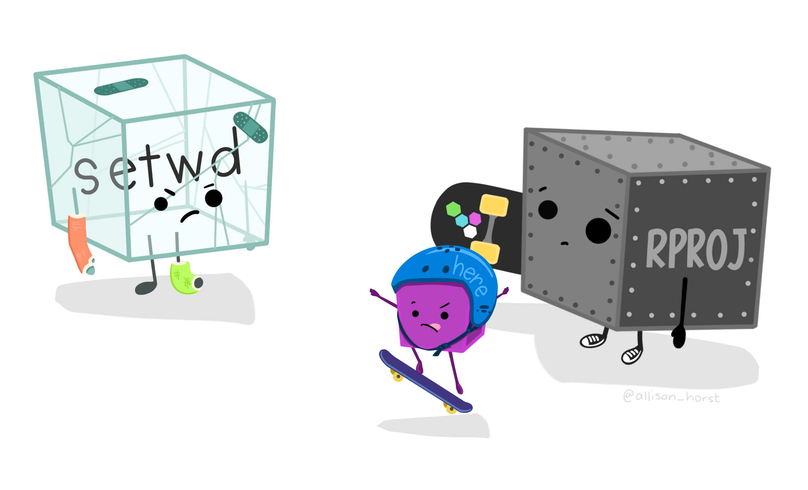

```{r setup, include=FALSE}
knitr::opts_chunk$set(echo = TRUE)
library(tidyverse)
```

```{r, echo = FALSE}

```

- Projects
- Quarto customization
- Creating vectors and sequences
- Our first `ggplot2` graph
- Functions continued

## 1. Projects

### ...one small step for a programmer, one giant leap for reproducibility

- In R, Session > New (make this a frequent habit)
- File > New Quarto project
- For now, New directory (but version control coming up soon...)
- Give your project a name
- Pick where to put it (this'll create a folder on your computer)
- Create project

Discussion - what does this do? Where does it live on your computer? What does it contain? 

- Make a new Quarto doc (File > New File > New Quarto document) in your project, then follow along (adding notes in markdown cells) with the rest of the session

## 2. Exponents and logs in R 

- `log()` = natural log
- `log10()` = log base 10
- `exp()` = natural exponential

Let's try some! 

## 3. Making sequences in R

Sometimes we'll want to create sequences of values that we can plug into a function to see how an output value changes over a range of inputs. 

We can make a sequence of values, stored as a *vector* in R, using the `seq()` function. The general structure looks like this: 

`seq(from = start_value, to = end_value, by = increment)`

For example, to create a sequence from 2 to 18 by increments of 0.3, I would use: 

```{r}
seq(from = 2, to = 18, by = 0.3)
```

Note that the above sequence ends at 17.9 (the last complete increment). Another option is to specify the *length* of the output vector instead - like "I want to have 30 values between 2 and 18, evenly spaced." To do that, use the `length = ` argument within the `seq()` function. 

```{r}
seq(from = 2, to = 18, length = 30)
```

## 4. Make the logistic growth function...function

We'll write a LOT of functions in R and Python (especially in EDS 221). For now, we can use the nice Cmd + Option + X shortcut to create a function for us.

Let's make a function of the logistic growth equation. Recall, the expression for population size at any time *t* following logistic growth is given by: 

$$N_t=\frac{K}{1+[\frac{K-N_0}{N_0}]e^{-rt}}$$

Let's write it out. **When in doubt, parentheses!** Keep in mind that you may want to make your argument names something a bit more descriptive. Always ask: What will make future me least likely to mess this up? What would make these function arguments clearest to my collaborators? 

```{r}
pop_logistic <- function(capacity, init_pop, rate, time_yr) {
  capacity / (1 + ((capacity - init_pop) / init_pop) * exp(-rate * time_yr))
}
```

### Logistic population - one time

Let's say that for a population of chipmunks in one region, the carrying capacity is 2,580 individuals, the exponential growth rate is 0.32 (yr^-1^), and time is in years. If the initial population is 230 individuals, what is the estimated population size a time = 2.4 years?

```{r}
pop_logistic(capacity = 2580, init_pop = 230, rate = 0.32, time_yr = 2.4)
```

### Logistic population - a lot of times

Now let's say we want to predict (then plot) the estimated population over a bunch of different times. Based on what we've learned today, how do you expect we might do that? **A sequence of values as the time input!** 

Let's make a sequence of times (0 to 20 years, by 1/2 year increments), then use *that vector* as our time input in the logistic growth model. 

```{r}
# First, create the vector (a sequence of values)
time_vec <- seq(from = 0, to = 20, by = 0.5)

# Then, use that as your time input in the model:
pop_logistic(capacity = 2580, init_pop = 230, rate = 0.32, time_yr = time_vec)
```

We want to plot those estimated population sizes - but we didn't store the vector of outputs! Remember - if you want to store an output, using the assingment operator (`<-`) in R, and check that it exists in your environment. 

```{r}
chipmunk_pop <- pop_logistic(capacity = 2580, init_pop = 230, rate = 0.32, time_yr = time_vec)

# Then we can call chipmunk_pop:
chipmunk_pop
```
## 5. Make a plot! 

You will learn a *lot* more about data visualization throughout MEDS. But let's make a first little rough one just for fun using the `ggplot2` package, which is part of the `tidyverse` (more on this in EDS 221). 

Attach the tidyverse in the setup chunk of your Quarto document using `library(tidyverse)`. Note: you should already have the package installed on your computer - if not, you'll need to do that first. 

Let's first combine our time sequence (`time_vec`) and predicted populations (`chipmunk_pop`) into a single *data frame* - a table of data where different vectors (we'll think of these as *variables* moving forward) are stored in columns. 

```{r}
chipmunk_df <- data.frame(time_vec, chipmunk_pop)

# ALWAYS look:
head(chipmunk_df)
```

Now follow along as Allison raves about the grammar of graphics to make a basic `ggplot` graph:

```{r}
ggplot(data = chipmunk_df, aes(x = time_vec, y = chipmunk_pop)) +
  geom_point()
```

## 6. No precious objects or outputs! 

- Save your .qmd, which lives in your project. 
- Close your whole project (File > Close project)
- Restart your R session & check environment 
- Find wherever your project lives on your computer
- Open the .Rproj file (NOT the .Rmd on its own - don't orphan your project files)
- Check for clues you're in your project 
- In the Files tab of RStudio, click on the .qmd you saved
- Use Cmd + Option + R to run all code in your .qmd
- Check to see that all objects and outputs are automatically reproduced

## End interactive session 1b

