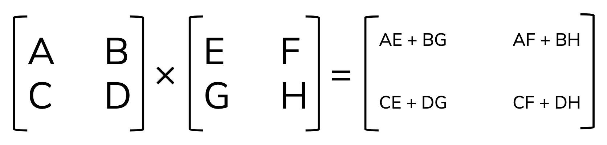

In this lesson, we'll learn about making & working with scalars, vectors and matrices in R and Python. We'll be working in both an R Markdown and Jupyter Notebook. 

```{r, include = FALSE}
library(reticulate)
```


## Set up

- Create a new repository on GitHub, with a ReadMe
- Clone and create a new version-controlled R Project
- Add a new R Markdown document
- Open Anaconda Navigator & Create a new Jupyter Notebook
- When you save your Jupyter NB, make sure it's saving *in your R project*

## Vectors

### Vectors in R

Create vectors in R using `c()`. Note that all elements in a vector must be a single class - if numbers and strings are combined, the whole thing will be of class character. 

For example: 

```{r}
# Create and store the vector:
marmots <- c("blue", "green", 4, "yellow")

# Return it:
marmots

# Check the class:
class(marmots)
```

If all values are numeric, however, it will be stored as a number:
```{r}
# Create and store the vector: 
pika <- c(12.4, 6.8, 2.9, 8.8, 5)

# Return it:
pika

# Check the class:
class(pika)
```
Notice in the vector above, these are class *numeric*. If values should be integers (often the case with count data), you can add an `L` after the value.

```{r}
# Create the integer vector:
bear <- c(20L, 3L, 5L, 18L, 23L)

# Look at it:
bear

# Check the class:
class(bear) 
```

We learn something important here: even *numbers* can be stored in R in different ways: **floats** are numbers that have decimals (these show up as class "numeric") and **integers**, numbers without decimals (these show up as class "integer"). 

You'll learn about data representation and other classes of data in EDS 221. 

#### Vector addition and subtraction, scalar multiplier, and dot product

You can add or subtract numeric vectors of equal length using basic operations. For example, let's make two new vectors of length 4, then try adding & subtracting them: 

```{r}
ringtail <- c(4.3, 8.9, 2.6, 7.1)
fox <- c(9.0, 12.5, 5.4, 10.9)

# Addition:
ringtail + fox

# Subtraction: 
fox - ringtail

# Scalar multiplier: 
100 * ringtail

# Dot product: 
ringtail %*% fox

```
### Vectors in Python (basics)

Using numpy (imported as np)

```{python}
import numpy as np
```

To make a vector, create a *list* (more on this in EDS 221) then convert to an array (with a single column = vector):

```{python}
# First make it a list of values (we'll learn more about lists in 221)
list_1 = [1,2,3]

# Make it a vector using np.array:
vec_1 = np.array(list_1)

# Return vec_1 to check it out
vec_1
```

Cool! Let's make another one so we can try some math: 

```{python}
list_2 = [10, 100, 1000]
vec_2 = np.array(list_2)
vec_2
```

Now we can do some math with our two vectors (`vec_1` and `vec_2`):

```{python}
# Addition:
vec_1 + vec_2

# Subtraction: 
vec_2 - vec_1

# Scalar multiplier: 
5 * vec_2
```

**BEWARE:** If you do these operations with the original *lists*, something very different will happen, since the `+` with lists appends the second list elements to the first list. Let's try it just for comparison: 

```{python}
list_1 + list_2
```

For the dot product, use `np.dot()`:
```{python}
np.dot(vec_1, vec_2)
```

## Matrices

### Matrices in R

A matrix contains data of a single class (usually numbers). Which means that we can think of the contents of a matrix as a single sequence of values, that are constrained (wrapped) to the specified dimensions of the matrix.

For example, let's say we have 10 values: 

```{r}
# Make a sequence of values from 1 - 10
my_values <- seq(from = 1, to = 10)

# Look at it (always)
my_values
```

Now, we can convert this into a matrix by letting R know how many rows these values should be "wrapped" into (the default is to populate by **column**...see documentation, and *always* look at what you've created):

```{r}
my_matrix <- matrix(data = my_values, nrow = 2, ncol = 5, byrow = TRUE)

# Check it out!
my_matrix
```

Try some other variations to make a matrix from `my_values` to test it out. What happens if you don't have enough elements in the matrix to contain your vector? What happens if your matrix has *more* elements than your vector? 

For example: 

```{r}
matrix(data = my_values, nrow = 3, ncol = 4, byrow = TRUE)
```

So...**always, always, always** look at what you've created. 

#### Scalar multiplication, addition and subtraction

Scalar multiplication of a matrix is straightforward: just use the multiply operator (*): 

```{r}
4 * my_matrix
```

Addition/subtraction requires matrices of the same dimension. Let's make another 2x5 matrix:

```{r}
my_values_2 <- seq(from = 21, to = 30)
my_matrix_2 <- matrix(my_values_2, nrow = 2, byrow = TRUE)

# Check it out:
my_matrix_2
```

Add the two matrices:
```{r}
my_matrix + my_matrix_2
```

Similarly for subtraction:
```{r}
my_matrix_2 - my_matrix
```

#### Matrix multiplication

As we saw in lecture, matrix multiplication is a bit more complicated (dot products of rows by columns become elements in the resulting matrix). Here's a reminder: 



We multiply matrices in R using the same operator as the dot product for vectors: `%*%`

For example: 
```{r}
# Make a couple of 2x2 matrices:
cats <- matrix(data = c(0,4,3,1), nrow = 2, byrow = TRUE)
dogs <- matrix(data = c(6,-3,0,2), nrow = 2, byrow = TRUE)

# Look at them: 
cats
dogs

# Matrix multiplication:
cats %*% dogs
```

Confirm that this is correct by doing the matrix multiplication by hand.

### Matrices in Python

Create a matrix in Python using the `np.matrix()` function (NumPy). Basically, by creating lists within a list...

```{python}
# Make one 2 x 2 matrix: 
matrix_1 = np.matrix([[1, 9], 
               [6, 0]])
print(matrix_1)

# Make another 2 x 2 matrix: 
matrix_2 = np.matrix([[0, 2],
                      [3, 10]])
                      
print(matrix_2)
```

Then we can do basic addition, subtraction, and scalar multiplication just like we did with vectors: 

```{python}
# Matrix addition example:
matrix_1 + matrix_2

# Matrix subtraction example:
matrix_1 - matrix_2

# Scalar multiplication example:
6 * matrix_1
```

For matrix multiplication, we use the `matmul()` function from NumPy:
```{python}
my_matrix_mul = np.matmul(matrix_1, matrix_2)

print(my_matrix_mul)
```

Confirm this matrix multiplication is correct - check by hand. 

## End


