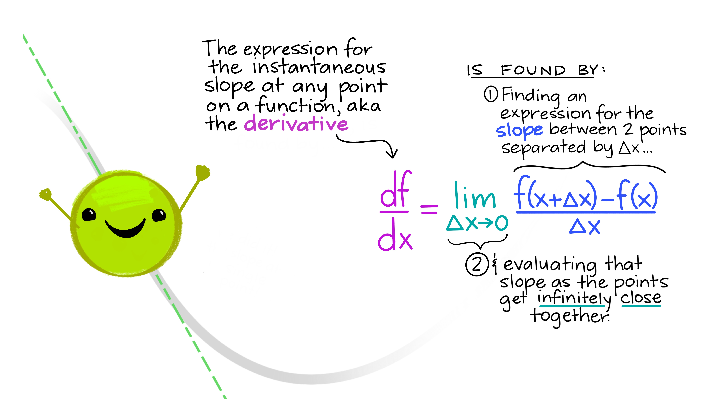

## Overview of Day 2 topics

- Derivatives 
- Higher order & partial derivatives
- Differential equations (reading, understanding, solving, using)

---

class: center, middle

## What if we want to find an expression that describes the rate of change (slope) at *any* point on a function?

---


---


---


---


---


---


---


---


---



---

## And that's how we find derivatives

Evaluate the slope between two generic points on any function (separated by $\Delta x$) as $\Delta x$ becomes infinitely small. 

```{r, echo = FALSE, out.width = "35%", fig.align = "center"}

```


---

### Let's try one.

Find an expression that tells us the slope of the function $f(x)=x^2-18.2$ at any value of $x$. 

$$\frac{df}{dx}=\lim_{\Delta x\to 0}\frac{f(x+\Delta x)-f(x)}{\Delta x}$$

$$=\lim_{\Delta x\to 0}\frac{((x+\Delta x)^2-18.2)-(x^2-18.2)}{\Delta x}$$
$$=\frac{x^2+2x\Delta x+(\Delta x)^2-18.2-x^2+18.2}{\Delta x}$$
---

Which gets us to...

$$= \lim_{\Delta x\to 0} \frac{2x\Delta x+(\Delta x)^2}{\Delta x} = \lim_{\Delta x\to 0} {2x+\Delta x} = 2x$$
---

## Your turn:

Find the derivative of the following using the definition of the derivative:

$$f(x)=4-x+3x^2$$

---

### It's cool to do that a few times, **but it gets really tedious really fast.**

So we have some basic derivative shortcut rules to speed it up a bit:

- **Power rule:** $\frac{d}{dx}(x^n)=nx^{n-1}$

- **Constant rule:**  if $k$ is a constant, $\frac{d}{dx}(k)=0$

- **Constant multiple rule:** if $k$ is a constant, $\frac{d}{dx}(kx) = k\space$

- **Sum and difference rule:** $\frac{d}{dx}(f(x)\pm g(x))=\frac{d}{dx} f(x)\pm \frac{d}{dx}g(x)$

Yeah there are more - we're not doing them.

---

**ALL** of those rules come from the definition of the derivative.

```{r, echo = FALSE, out.width = "70%"}

```

---
class: center, middle

## Reminder of what we're doing mathematically:

### Finding the slope between two generic points on a function as the distance between them gets infinitely small. That will give us an expression for the **slope at any point on the original function**.

---

## Derivative of logs & exponents

- $\frac{d}{dx}(e^x) = e^x$

- $\frac{d}{dx}ln(x)=\frac{1}{x}$
