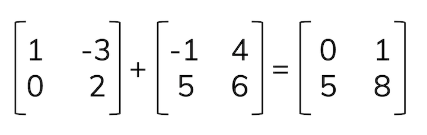
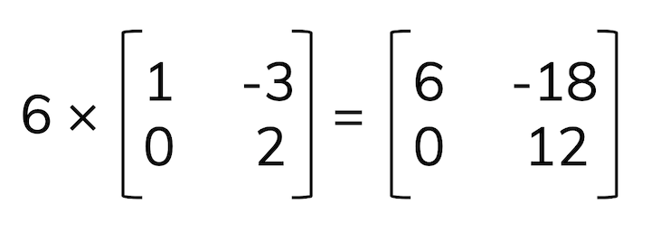
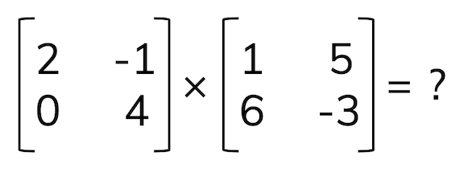
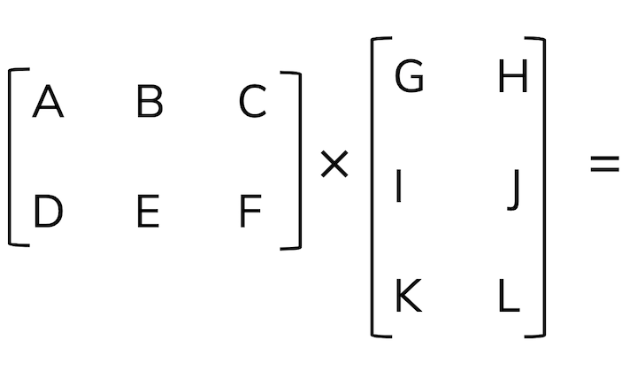
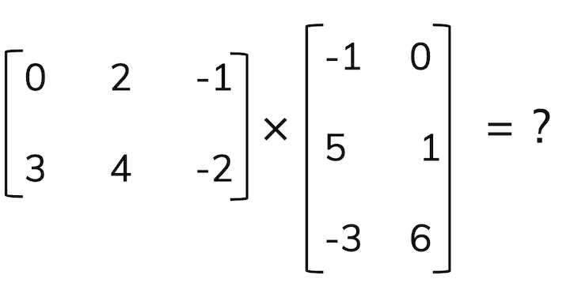

## Part 1: Linear algebra continued

- Linear dependence / independence
- Spans (systems of linear equations)
- Using linear algebra in environmental data science

---

## Vectors as scaled linear combinations of unit vectors

We can write vectors and linear combinations of scaled unit vectors, $\hat{i}$ and $\hat{j}$, which correspond to a vector of length 1 along the x and y axis, respectively. 

So, for example, the vector $\vec{u}=[4,7]$ can also be written as: 

$$\vec{u}=4\hat{i} + 7\hat{j}$$
---

## Matrices

A matrix is a table of values (multiple vectors in combination). A vector, therefore, can be thought of as a matrix with a single column. 

- Dimensions: the size of the matrix, in rows x columns (*m* x *n*)
- Elements: values in a matrix, often denoted symbolically with a subscript where the first number is the *row* and the second number is the *column* (e.g. $a_{34}$ indicates the element in row 3, column 4)

---

## Matrices as systems of equations

---

## Matrix algebra

### Addition & subtraction

Add or subtract the corresponding elements (by matrix position) to create a new matrix of the same dimensions. 

.center[

]

---

## Scalar multiplication

To multiply a matrix by a *scalar*, multiply each element in the matrix by the scalar to get a scaled matrix of the same dimensions.

For example: 

---

## Matrix multiplication

**First thing to know: dot product**

For vectors $\vec a$ and $\vec b$, their dot product is:

$$\vec a \cdot \vec b = \sum a_i b_i$$
**In words:** The dot product is the sum of elements of each vector multiplied together, and is a measure of how close the vectors "point" in the same direction
---

## Dot product example

For $\vec a=[2,-1,0]$ and $\vec b=[9,3,-4]$:

$$\vec a \cdot \vec b = (2)(9)+(-1)(3)+(0)(-4) =15$$
---

## What happens when we have orthogonal vectors? 

Sketch a quick graph, then find the dot product, of the following vector combinations: 

1. $\vec a=[0,4]$ and $\vec b =[6,0]$

2. $\vec c=[-3,1]$ and $\vec d=[2,6]$

What is the value of the dot product for orthogonal vectors? 

---

## Now we have the tools we need to multiply matrices

We find the *dot product* of row $\cdot$ column vectors:

---

## Practice problem:

---

## Critical thinking: Matrices with unequal dimensions

What do you think the output matrix would contain if you were multiplying the following? 

## Let's try one!

---

## Diagonal matrix

---

## Examples: matrices in environmental science

