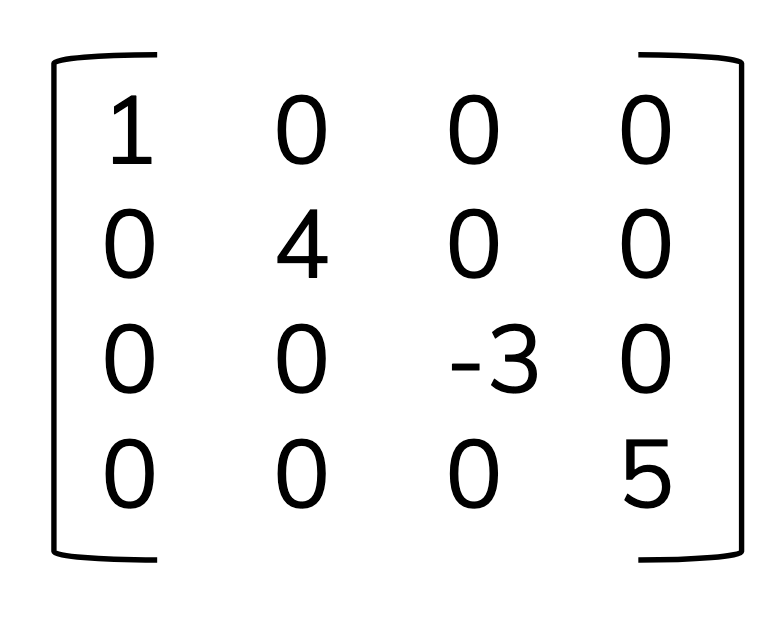
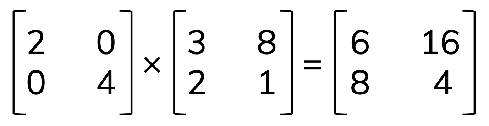
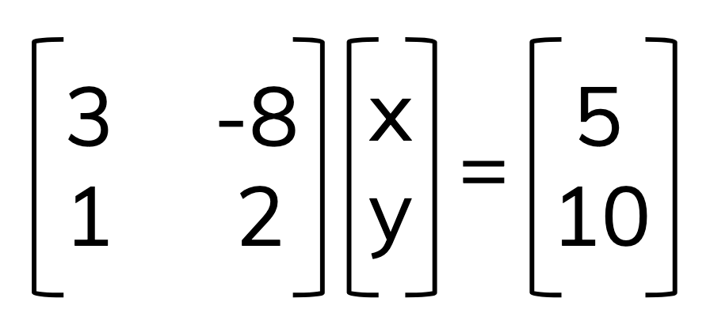
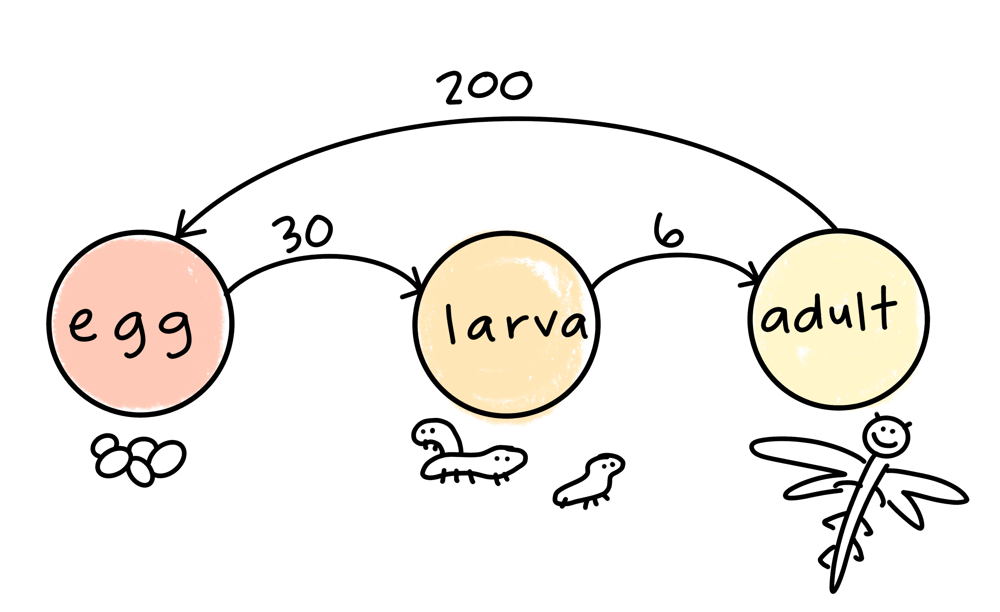
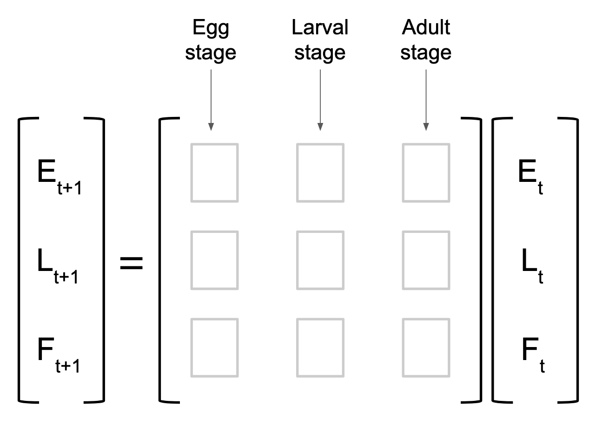
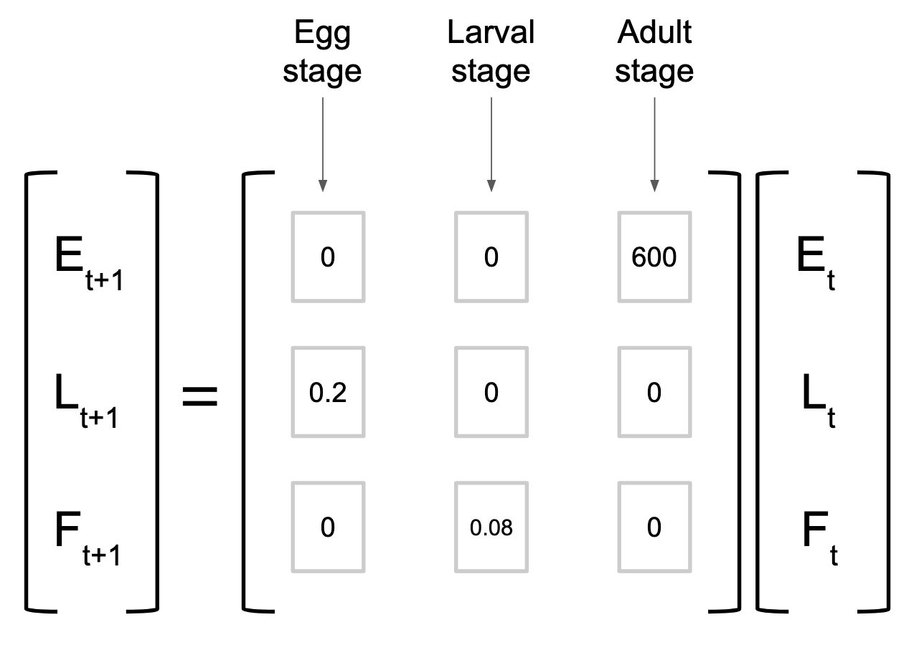

## Part 1: Linear algebra continued

- Refresher: vectors and working with them
- Matrices: notation, language, basic algebra
- Representing systems of equations with matrices
- Linear algebra in environmental science

---

## Matrices

A matrix is a table of values (multiple vectors in combination). A vector, therefore, can be thought of as a matrix with a single column. 

- Dimensions: the size of the matrix, in rows x columns (*m* x *n*)
- Elements: values in a matrix, often denoted symbolically with a subscript where the first number is the *row* and the second number is the *column* (e.g. $a_{34}$ indicates the element in row 3, column 4)

---

## Matrix algebra

### Addition & subtraction

Add or subtract the corresponding elements (by matrix position) to create a new matrix of the same dimensions. 

.center[

]

---

## Scalar multiplication

To multiply a matrix by a *scalar*, multiply each element in the matrix by the scalar to get a scaled matrix of the same dimensions.

For example: 

---

## Recall: dot product

The dot product of two vectors is the sum of their elements multiplied:

For $\vec a =[1,5]$ and $\vec b = [2,-3]$:

$$\vec a \cdot \vec b=(1)(2)+(5)(-3)=-13$$

---

## Matrix multiplication

We find the *dot product* of row $\cdot$ column vectors:

---

## Practice problem:

---

## Critical thinking: Matrices with unequal dimensions

What do you think the output matrix would contain if you were multiplying the following? 

## Let's try one!

---

## Diagonal matrix

A **diagonal matrix** is (almost always) a square matrix ($m$ = $n$) where only elements on the diagonal are non-zero values. 

.center[

]

---

## What happens when we multiply a matrix by a diagonal matrix? 

A diagonal matrix is also called a *scaling matrix* because it scales rows proportionally, but not by the same value:

.center[

]

---

## Matrices as systems of equations

Often in environmental data science, we have multiple equations representing processes. Matrices give us a way to express these *systems of equations* in data structures that are easy to store and work with in data science. For example, let's say we have a system: 

$$3x-8y=5$$

$$x + 2y = 10$$

How can we write this using matrices? 

---

## Rewriting in matrix form:

$$3x-8y=5$$

$$x + 2y = 10$$

The matrix form of this system of equations looks as follows: 

.center[

]

---

## Example: matrices and linear algebra in environmental science

### Leslie Matrix: Population ecology

A matrix model that accounts for survival / fecundity rates at different life stages for a species. 

--- 

### Overview: 

- Define life stages

- Estimate probability of survival / reproduction at different life stages to create a matrix over time

- Combine into a matrix that allows calculation at the next time step

.center[

]

---

## Writing estimates as equations:  

- For our species, each adult female will lay ~600 eggs during each cycle (let's say that's a year). Which means that the eggs at time $t+1$ can be estimated by the number of adult females * 600:

$$E_{t+1}=600 * F_t$$

---

$$E_{t+1}=600 * F_t$$

We also estimate that 20% of eggs survive to reach larval stage:

$$L_{t+1} = 0.2*E_t$$

---

$$E_{t+1}=600 * F_t$$
$$L_{t+1} = 0.2*E_t$$

We also estimate that 8% of those that reach larval stage will survive to become reproducing female adults:

$$F_{t+1}=0.08*L_t$$

---

$$E_{t+1}=600 * F_t$$

$$L_{t+1} = 0.2*E_t$$

$$F_{t+1}=0.08*L_t$$

How can we write this in matrix form?

.center[

]

---

.center[

]

---

See also: Bison model 

https://www.google.com/url?sa=t&rct=j&q=&esrc=s&source=web&cd=&ved=2ahUKEwjy2ZDKuOPxAhUJ6J4KHb39CPcQFnoECCUQAA&url=http%3A%2F%2Fwww.math.utk.edu%2F~heather%2Flecture17.pdf&usg=AOvVaw00r4mdhuKtpWff0QO12YaF

---

exclude: true

## Vectors as scaled linear combinations of unit vectors

We can write vectors and linear combinations of scaled unit vectors, $\hat{i}$ and $\hat{j}$, which correspond to a vector of length 1 along the x and y axis, respectively. 

So, for example, the vector $\vec{u}=[4,7]$ can also be written as: 

$$\vec{u}=4\hat{i} + 7\hat{j}$$

