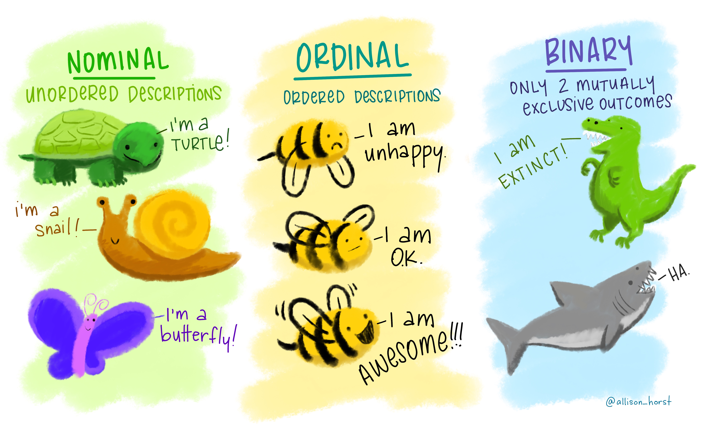
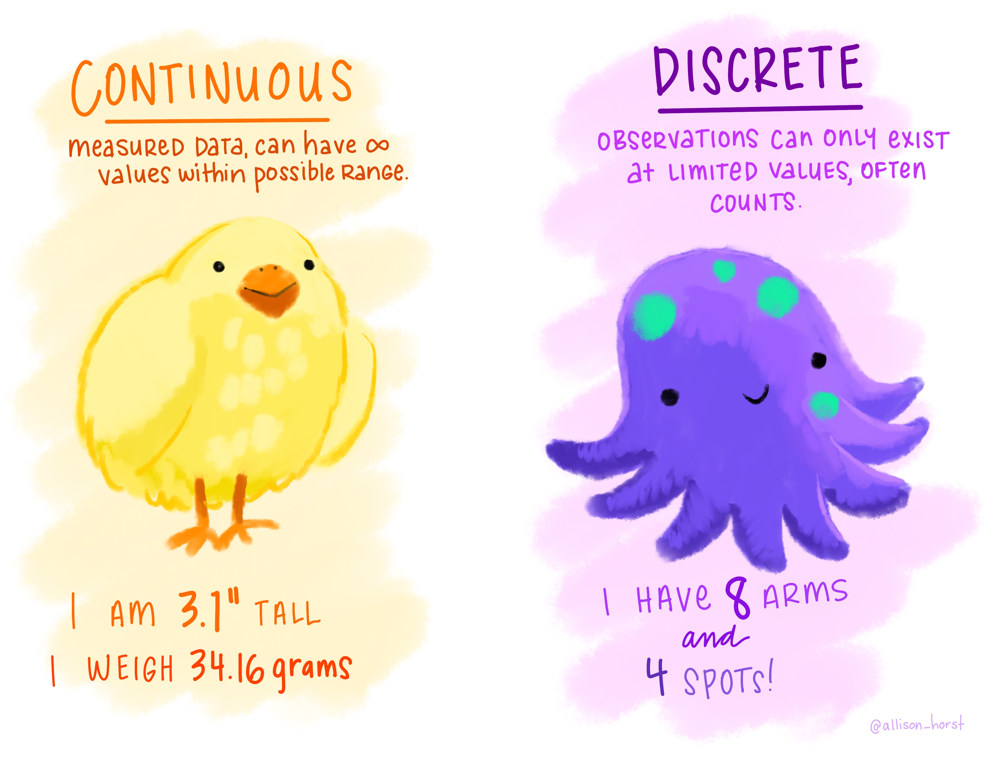
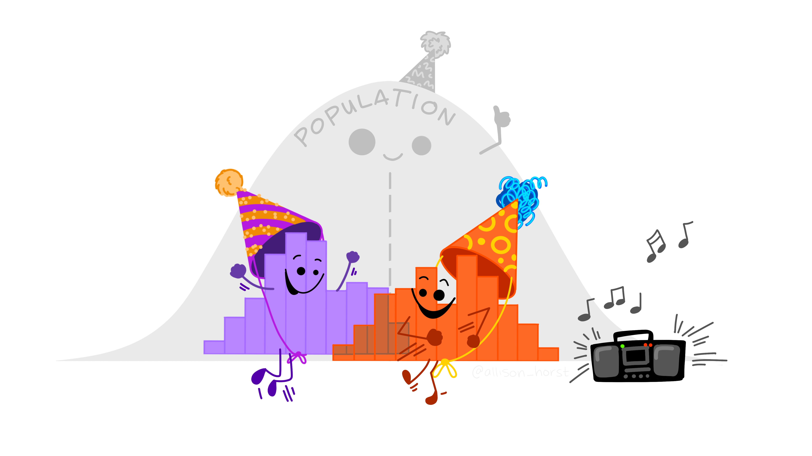

```{r, include = FALSE}
library(tidyverse)
library(palmerpenguins)
```

## Data types

- **Quantitative:** numeric information 

- **Qualitative:** descriptions (usually words)

### A bit deeper: 

  - **Continuous:** measured values, can take an of infinite possible values for a variable
  - **Discrete:** can only have certain values (e.g. counts)
  - **Ordinal:** order matters, but the difference between values isn't known or equal (e.g. Likert Scale)
  - **Binary:** only two possible outcomes (yes/no, true/false, 1/0)

---

## Nominal, ordinal, binary data:

.center[

]

---

## Quantitative data: continuous & discrete

.center[

]

---

## Data distributions

.center[

]

---

## How can we describe how data are distributed?

#### Our starting points: 

- Shape / patterns / clusters (data vizualization)
- Central tendency (mean / median)
- Spread & uncertainty (standard deviation / standard error / confidence interval)

---

## Useful data visualizations

- Histograms
- Boxplots
- Scatterplots 

...then get even more involved: 

- Beeswarm
- Marginal plots
- Raincloud plots
- Pairs plots

---

## Histogram: a graph of the frequency of observations within a series of bins (usually of equal size) for a variable

Example: distribution of penguin flipper lengths for chinstrap penguins

```{r, echo = FALSE, fig.height = 25, fig.width = 100}
penguins %>% 
  filter(species == "Chinstrap") %>% 
  ggplot(aes(x = flipper_length_mm)) +
  geom_histogram(bins = 18)
```

---

### Boxplot

#### Most often: 

- Box extends to 1st and 3rd quartile observation values
- Line at the median value
- Whiskers extend to last observation within 1 step (1 step = 1.5*interquartile range)
- Anything beyond whiskers indicated with a dot at the observation value

---

## Boxplot example: 

```{r}
teddy_miles <- c(1.0, 1.2, 1.8, 2.1, 2.4, 2.9, 3.4, 4.7, 5.1, 5.6, 7.8, 10.4, 15.4)
boxplot(teddy_miles, horizontal = TRUE)
```

---

### Scatterplots

---

Always, always, always look at your data. It is the only way to make a responsible decision about an appropriate type of analysis. 

---

### Summarizing data numerically

- Central tendency
- Variance and standard deviation
- Standard error
- Confidence interval

---

### Mean

Average value of sample observations, calculated by summing all observation values and dividing by the number of observations

- Pros: 
    - Average value is often useful metric
    - Commonly reported
    
- Cons:
    - Susceptible to outliers and skew
    - Subject to misinterpretation as "most likely value"
    
---

### Median

Middle value when all observations are arranged in order - for n = even, the average of the middle two values.

- Pros: 
    - Less susceptible to skew and outliers
    - Better as sample size increases
    
- Cons: 
    - Doesn't take into account all values

---

### Variance and standard deviation

---

Beware summary statistics alone...

## Meet the dreaded DINO DOZEN

---

### Confidence interval

**Confidence interval:** a range of values (based on a sample) that, if we were to take multiple samples from the population and calculate the confidence interval from each, would contain the true population parameter X percent of the time. 

---

### Confidence interval example

---

### Communicating data summaries

- The "Bar bar plots" philosophy: show as much as you can for the audience you're presenting to
- Summary statistics are often useful, but are a small part of the data's whole story
- Strongest when accompanied by data visualization

---


