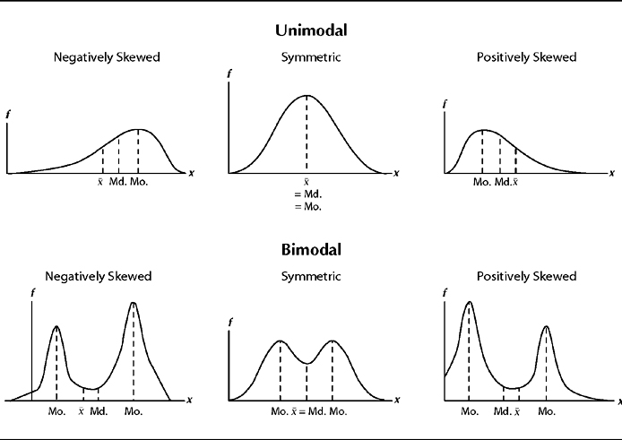
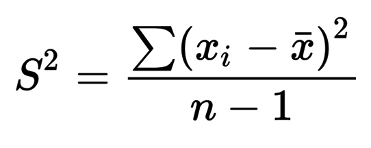
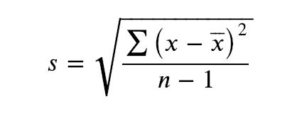
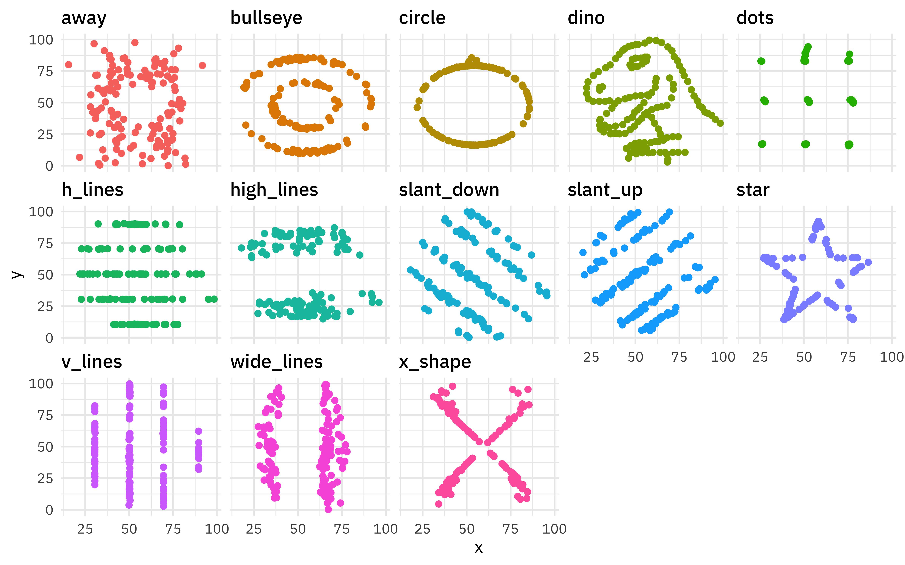
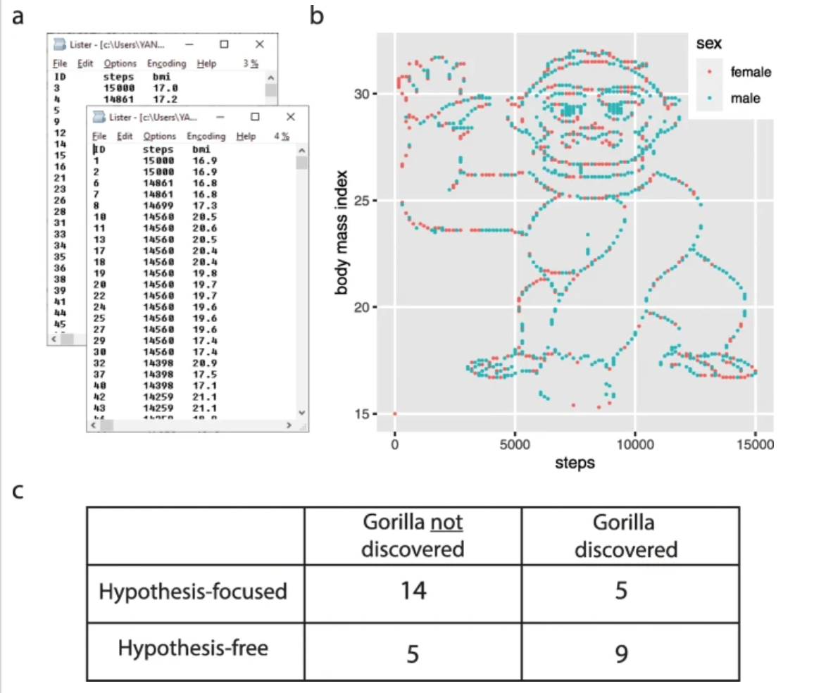

```{r, include = FALSE}
library(tidyverse)
library(palmerpenguins)
```

## Data types

- **Quantitative:** numeric information 

- **Qualitative:** descriptions (usually words)

### A bit deeper: 

  - **Continuous:** measured values, can take an of infinite possible values for a variable
  - **Discrete:** can only have certain values (e.g. counts)
  - **Ordinal:** order matters, but the difference between values isn't known or equal (e.g. Likert Scale)
  - **Binary:** only two possible outcomes (yes/no, true/false, 1/0)

---

## Nominal, ordinal, binary data:

.center[

]

---

## Quantitative data: continuous & discrete

.center[

]

---

## Data distributions

.center[

]

---

## How can we describe how data are distributed?

#### Our starting points: 

- Shape / patterns / clusters (data vizualization)
- Central tendency (mean / median)
- Spread & uncertainty (standard deviation / standard error / confidence interval)

---

## Useful data visualizations

- Histograms
- Boxplots
- Scatterplots 

...then get even more involved: 

- Beeswarm
- Marginal plots
- Raincloud plots
- Pairs plots

---

## Histogram: a graph of the frequency of observations within a series of bins (usually of equal size) for a variable

Example: distribution of penguin flipper lengths for chinstrap penguins

```{r, echo = FALSE, fig.height = 25, fig.width = 100}
penguins %>% 
  filter(species == "Chinstrap") %>% 
  ggplot(aes(x = flipper_length_mm)) +
  geom_histogram(bins = 18)
```

---

### Boxplot

#### Most often: 

- Box extends to 1st and 3rd quartile observation values
- Line at the median value
- Whiskers extend to last observation within 1 step (1 step = 1.5*interquartile range)
- Anything beyond whiskers indicated with a dot at the observation value

---

## Boxplot example: 

```{r}
teddy_miles <- c(1.0, 1.2, 1.8, 2.1, 2.4, 2.9, 3.4, 4.7, 5.1, 5.6, 7.8, 10.4, 15.4)
teddy_miles <- data.frame(teddy_miles)
```

```{r, warning = FALSE, message = FALSE, fig.height = 3, fig.width = 5, fig.align = "center"}
ggplot(data = teddy_miles, aes(x = teddy_miles)) +
  geom_boxplot()
```


---

### Scatterplots

Always, always, always look at your data. It is the only way to make a responsible decision about an appropriate type of analysis. 

.center[
```{r, warning = FALSE, fig.height = 4, fig.width = 5}
ggplot(data = penguins, aes(x = bill_depth_mm, y = bill_length_mm)) +
  geom_point(aes(color = species))

```
]


---

### Summarizing data numerically

- Central tendency
- Variance and standard deviation
- Standard error
- Confidence interval

---

### Mean

Average value of sample observations, calculated by summing all observation values and dividing by the number of observations

- Pros: 
    - Average value is often useful metric
    - Commonly reported
    
- Cons:
    - Susceptible to outliers and skew
    - Subject to misinterpretation as "most likely value"
    
---

### Median

Middle value when all observations are arranged in order - for n = even, the average of the middle two values.

- Pros: 
    - Less susceptible to skew and outliers
    - Better as sample size increases
    
- Cons: 
    - Doesn't take into account all values

---

.center[

]

Image: Sirkin, R. M. (2006). Measuring central tendency. In Statistics for the social sciences (pp. 83-126). SAGE Publications, Inc., https://www.doi.org/10.4135/9781412985987

---
class: center, middle

## The best way to describe the distribution of the data is to present the data itself. 

---

## Variance and standard deviation

Measures of **data spread**. 

- **Variance:** Mean squared distance of observations from the mean

.center[

]

Where $s^2$ is the sample variance, $x_i$ is a sample observation value, $\bar x$ is the sample mean, and $n$ is the number of observations. 

---

## Standard deviation

Also a measure of data spread, calculated by taking the square root of the variance.

.center[

]

---

Beware summary statistics alone...meet the DINO DOZEN

.center[

]

---

.center[

]

From: Yanai, I., Lercher, M. A hypothesis is a liability. Genome Biol 21, 231 (2020). https://doi.org/10.1186/s13059-020-02133-w

---

### Confidence interval

**Confidence interval:** a range of values (based on a sample) that, if we were to take multiple samples from the population and calculate the confidence interval from each, would contain the true population parameter X percent of the time. 

**What it's NOT:** "There is a 95% chance that the true population parameter is between values X and Y." 

---

### Confidence interval example

Mean shark length is 8.42 $\pm$ 3.55 ft (mean $\pm$ standard deviation), with a 95% confidence interval of [6.45, 10.39 ft] (n = 15). 

What this **DOES NOT** mean: There is a 95% chance that the true population mean length is between 6.45 and 10.39 feet. 

What this **DOES** mean: 95% of calculated confidence intervals for samples drawn from this population will contain the true population parameter. This CI could be one of the 95%. It could also be one of the 5% that does *not* contain the true population parameter!


---

### Communicating data summaries

- The "Bar bar plots" philosophy: show as much as you can for the audience you're presenting to
- Summary statistics are often useful, but are a small part of the whole data story
- Uncertainty is important! How can we responsibly communicate it?
- All summaries are strongest when accompanied by additional data communication

