## Think about your question: Abraham Wald's memo

.center[
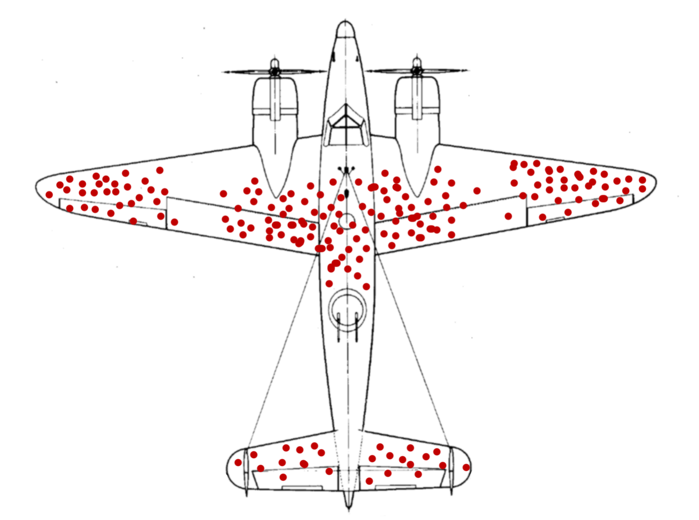
]

---

## Hypothesis testing: building intuition, continued

You'll learn about hypothesis testing in EDS 222. Let's just build a bit more intuition here. 

A common question: are means from two samples so different (considering data spread and sample size) that we think we have enough evidence to reject a null hypothesis that they were drawn from populations with the **same** mean? 

*Caveat, assumptions, caveat (EDS 222)...*

---

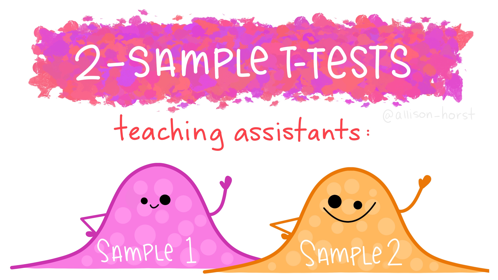

---

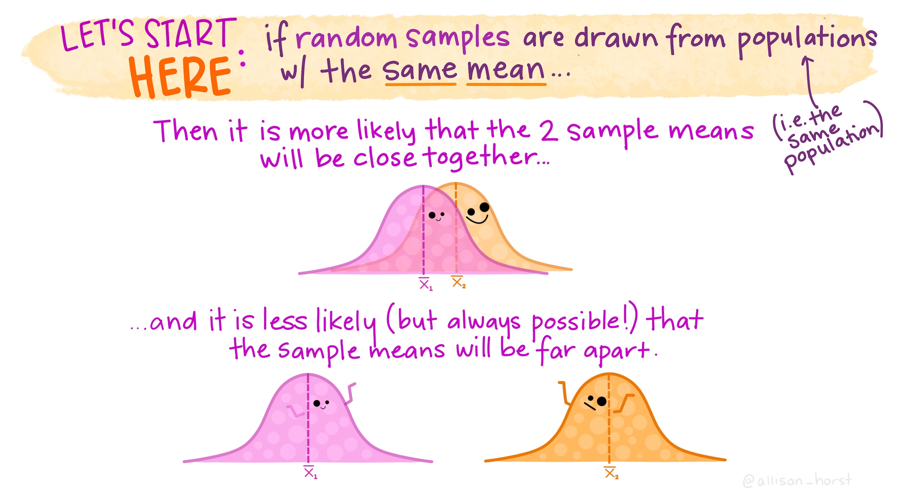

---

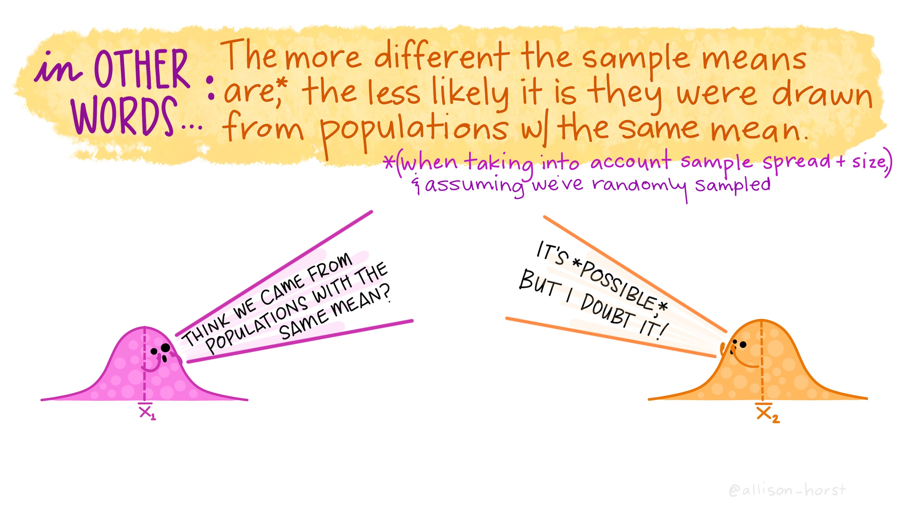

---

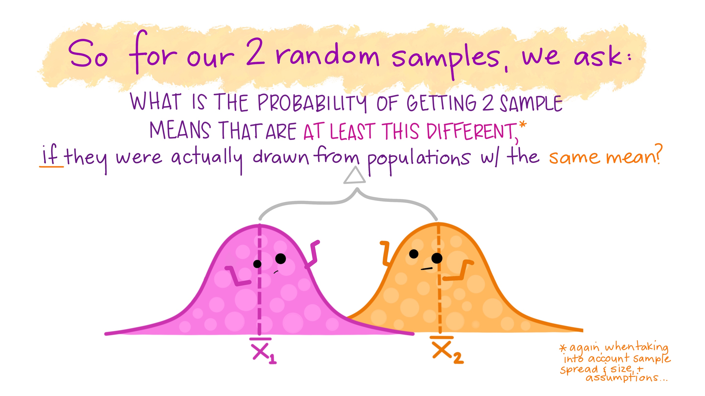

---

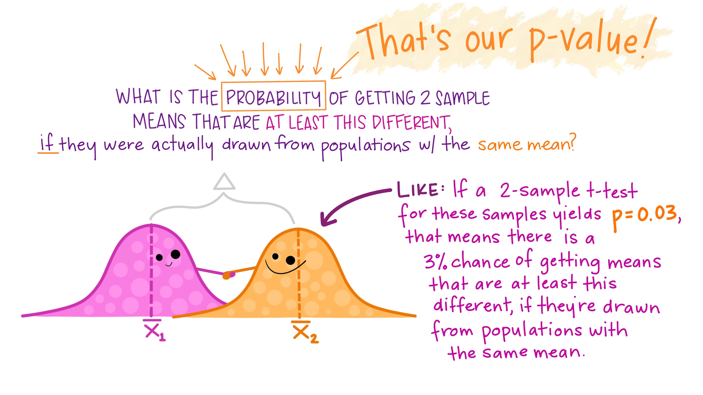


---

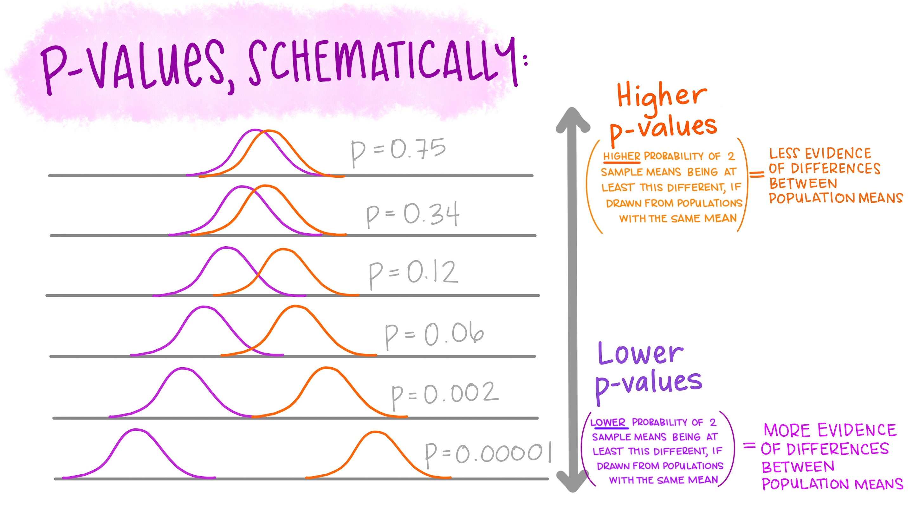

---

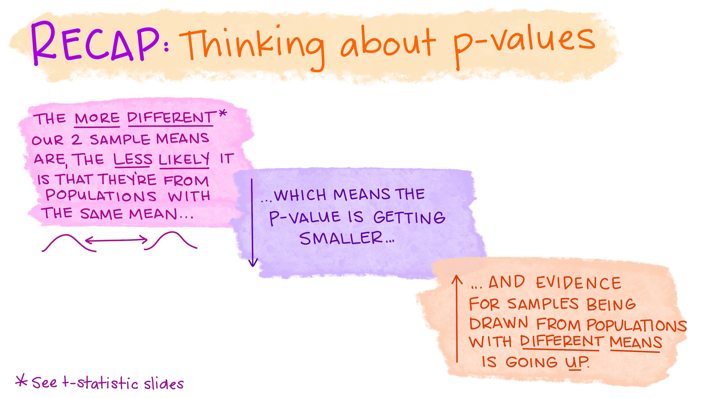

---

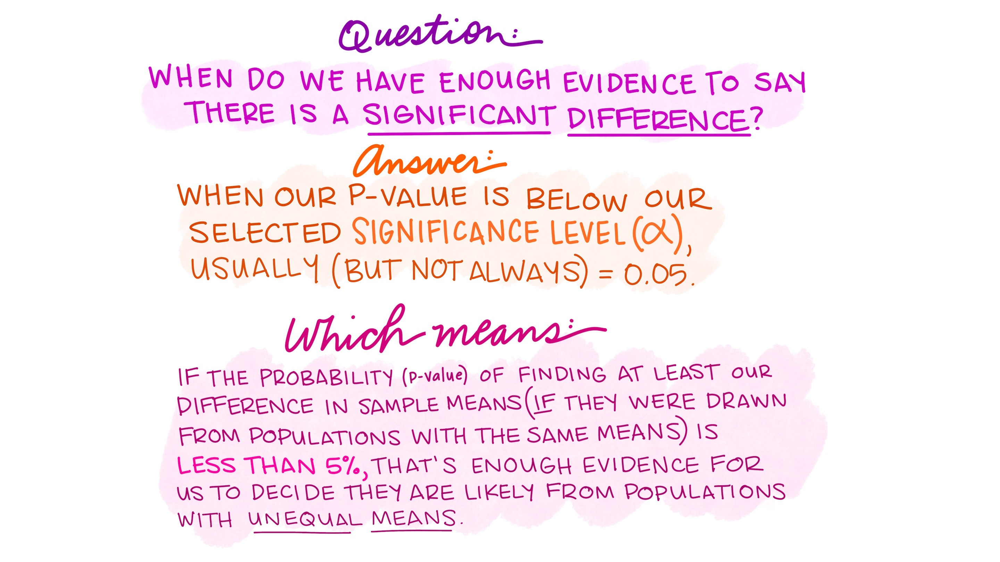

---

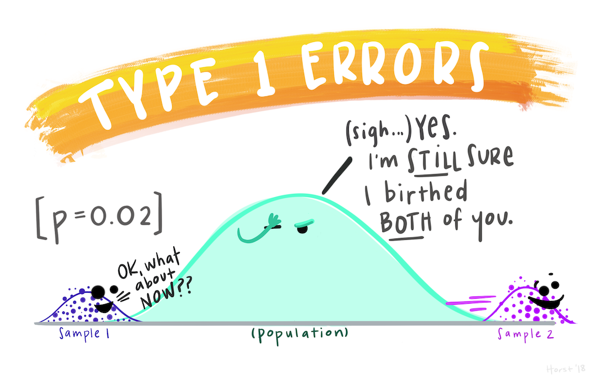
---

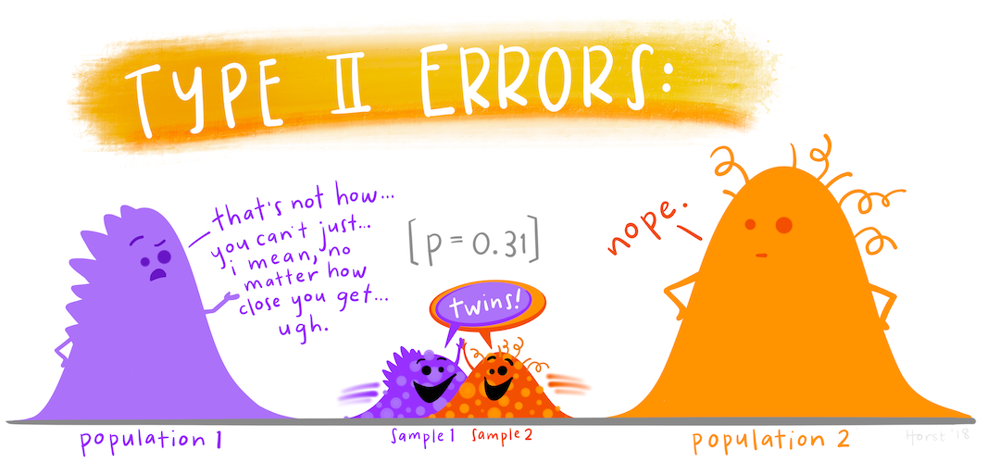

---

## Boolean logic

**Definition:** "In mathematics and mathematical logic, Boolean algebra is the branch of algebra in which the values of the variables are the truth values true and false, usually denoted 1 and 0, respectively" (Wikipedia)  

---

## Computer think

How would a computer order the objects in the following statements? 

- **Nothing** is better than a **burrito**
- A **loaf of bread** is better than **nothing**

---

## Mathematically...

- Nothing > burrito: TRUE

- Loaf of bread > nothing: TRUE

To a computer: Loaf of bread > nothing > burrito.

---

## In environmental data science

- Conditional statements
- Filtering, subsetting, searching
- Checking classes and verification
- Testing

---

## Logical operators

- Logical "and": `&` 
- Logical "or": `|` 
- Logical "negate": `!`

---

## Comparison operators

- Is equal to? `==` 
- Is less than? `<`
- Is less than or equal to? `<=`
- Is greater than? `>`
- Is greater than or equal to? `>=`
- Is not equal to? `!=`

A computer evaluates these and the outcome is either `TRUE` or `FALSE`, and proceeds accordingly. 

---

## An important distinction:

==: This is...equal to?

=: This IS equal to. 

> 5 == 4 
  
    > FALSE

---

## Examples: 

Elements of a vector are tested separately, and the outcome is returned in a vector:

```{r}
marmot <- c(1,2,3)
marmot == 2
```

```{r}
pika <- c(1,2,5,9,10,15)
pika == 1 | pika >= 9
```

---

## Checking data classes works similarly: 

More on data types & structures in EDS 221!

```{r}
bear <- c(1,4,3, NA, 6) # Create a vector
is.na(bear) # Check element by element for == NA?
is.numeric(bear) # Checks entire *class* of vector
```

---

## Another we'll see often: `%in%` 

- `%in%`: check for matching elements (not in order)*

**Example:** We have two vectors, and we want to know if any values in `vole` are also in `mouse`

```{r}
vole <- c(1,3,4,7,10,15)
mouse <- c(0,2,4,0,0,NA,11,15,20)

vole %in% mouse
```

*Keep this in mind - the distinction between `%in%` and `==` is major and important.
