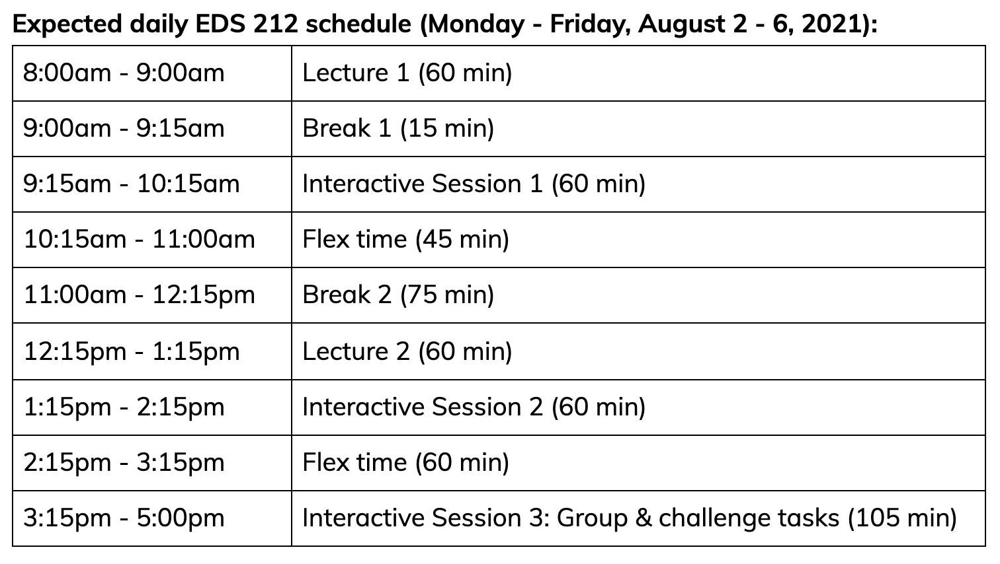

## Welcome to EDS 212 - Essential Math in Environmental Data Science

- **Teacher:** Allison Horst (ahorst@ucsb.edu)
- **Course assistant:** 
- **Course hours:** 8am - 5pm PST, Monday - Friday
- **Location:** NCEAS MEDS Classroom

Let's take a look at the [course syllabus](https://docs.google.com/document/d/1Kcc9BhZuKeAGxQeW0ls7KY0oUtt-TBwEgOibl4_ShtY/edit?usp=sharing) together. 

---

## Course description

- **Units:** 2
- **Grading:** Pass/No Pass 
- **Description:** Quantitative skills and understanding are critical when working with, understanding, analyzing and gleaning insights from environmental data. In the intensive EDS 212 course, students will refresh fundamental skills in math (algebra, uni- and multivariate functions, units and unit conversions), summary statistics and basic probability theory, derivative and differential equations, linear algebra, and reading, writing and evaluating logical operations.

---

---

## Topics overview

- **Day 1:** Course introduction & math basics refresher
- **Day 2:** Derivatives
- **Day 3:** Integrals
- **Day 4:** Differential equations
- **Day 5:** Linear and Boolean algebra

---

class: center, middle

## Why am I taking a math class? 

(or, *Why do I have to know math when a computer will do it for me?*)

---

## A quantitative brain warm-up

### MEDS students have diverse work & academic histories

This course re/introduces math concepts and tools that: 

- Focus on applications to environmental data science
- Are specifically relevant for MEDS projects, coursework
- Provide an entryway into building computational skills
- Refresh quantitative thinking skills generally
- Refresh essentials like units, conversions, notation, language

---

class: center, middle

## Examples: Math in environmental data science

---

## Example 1: 

---

## Example 2:

---

## Example 3:

---

## Example 4:

---

class: center, middle

## But first, warm-up stretches

---

## Math brain warm up

- Algebra blitz
- Common units and unit conversions
- Exponentials and logarithms
- Functions
- Understanding graphs
- Interpreting equations

---

## Algebra blitz

### You can get far with a few rules

- Order of operations
- Equations are already solved (but sometimes we need them in a different format)
- Do whatever you want but do the same thing to both sides

---

## Order of operations (P-E-MD-AS)

**P** - Parentheses

**E** - Exponents

**M/D** - Multipication / division

**A/S** - Addition / subtraction

---

## Order of operations practice problems

Simplify the following: $(12 - 2)/5 + 5(3+2)/6$

 

Simplify the following: $\frac{4-6}{2}(3+1)-\frac{1+2*4}{3}$

 

Simplify the following: $3x+4(8x-6x) -(2y-5)+\frac{2x(1-3)}{2}$

---

## Notation matters

Simplify the following: $6 \div 3(4+2)$

--

What would be a harder-to-misinterpret way to write this?

--

### Important takeaway: Being readable & hard to incorrectly interpret is often as important as being technically "correct"

When designing things, it's important to consider the different ways that users might misuse or misunderstand it - then build in safeguards to help them use it correctly. Clear communication and user-centered design is critical in environmental data science. 

---

## Equations are solved

 

$$2x-5y+3.9=8x^2-100.7x$$
 

Provides solutions for the questions:

1. "What is the value of $2x-5y+3.9$?" and 
2. "What is the value of $8x^2-100.7x$?"
---

## It is often helpful to reorganizing things

In the equation on the previous slide (shown below), we might want to solve for *y*:

$$2x-5y+3.9=8x^2-100.7x$$
 
### The one rule to rule them all: 

You can do whatever you want to an equation, as long as you do **the exact same thing to both sides.** That includes ensuring that you are applying something entirely to each side. 

---

## We're really just doing the same thing to both sides until we're happy with the format

### Example: 

Apply the same operation to each side of the following equation step-by-step to isolate $x$ on one side. **Write out all steps.**

$$4x+8=5-2x$$

---

### Example: 

Apply the same operation to each side of the following equation step-by-step to isolate $a$ on one side. **Write out all steps.**

$$\frac{2(a+1)}{3a}+4=6$$
---

## Exponents & how to do math with them

$$x^n=x\times x\times\ x \times x...(n\space times)$$
### Exponent warm-ups
Evaluate the following to find a value for $y$:

1. $y = 12-2^4$

2. $2y + 30=y+3^3$

---

## Exponent rules

--

- $x^ax^b=x^{a+b}$ ; **Example:** $y^5y^3=x^{5+3}=x^8$

--

- $\frac{x^a}{x^b}=x^{a-b}$ ; **Example:** $\frac{z^5}{z^3}=z^{5-3}=z^2$

--

- $\frac{1}{x^a}=x^{-a}$ ; **Example:** $b^{-4x}=\frac{1}{b^{4x}}$

--

- $(x^a)^b=x^{ab}$ ; **Example:** $(2^3)^2=2^{3*2}=2^6=64$

--

- $(\frac{x}{y})^a=\frac{x^a}{y^a}$ ; **Example:** $(\frac{y}{2^2})^2=\frac{y^2}{(2^2)^2}=\frac{y^2}{2^4}=\frac{y^2}{16}$

--

- $(xy)^a=x^ay^a$ ; **Example:** $(3x)^2=3^2x^2$

---

## Exponent practice

Simplify the following expressions using the rules of exponents:

1. $3x^5x^8x^{-11}$

2. $\frac{-8x^6}{2x^4}+7x^2$

3. $\frac{3x}{x^5}-3.8x^4\frac{x^3}{x^6}+8.1x-11.2$

---

## Multiplying expressions (FOIL)

**F**irst, **O**utside, **I**nside, **L**ast

**Example:**

$$(2x+5)(x-3)$$
$$=2x^2-3*2x+5*x-5*3$$
$$=2x^2-x-15$$
---

# UNITS. UNITS. UNITS.

Think about these statements, which all contain the same *value* of 4:

- There are four in the refrigerator.

- There are four **burritos** in the refrigerator.

- There are four **roaches** in the refrigerator.

- There are four **million dollars** in the refrigerator.

---

class: center, middle

### Units are critical in environmental data science. We cannot responsibly work with data without knowing the units of **each variable we're working with**.

### That means we need to always **familiarize ourselves with metadata**, carefully **check units and any unit conversions**, and understand **how units combine to into the units of a dependent variable**.

---

## Dimensional analysis for unit conversions

---

## Unit conversion practice

---

## Functions

Functions are mathematical expressions that tell us how input values are related to output values. 

For example, $y = 3x-5$ is a function that tells us the **value of y** at **any value of x**. In this scenario, we would probably say **y is a function of x**. 

Could you also rewrite it and say **x is a function of y**? Here, with no knowledge of what's an input and what's an output, sure - but usually in environmental data science we specify the input variable(s), and the output variable(s) carefully. 

What follows is the expression in the format of: "**[output variable(s)] is/are a function of [input variable(s)]**". 

---

## Thinking about inputs and outputs

For the following combinations of related variables, which do you expect would be the **input** and the **output** in a function describing how they are related? Say your answer in a sentence, e.g. "Evapotranspiration is a function of air temperature."

1. fuel (biomass) / slope / wildfire severity / windspeed / air temperature

2. water temperature / kelp biomass / solar irradiation 

3. soil C:N ratio / bacterial biomass / soil water content / leaf litter decomposition rate

4. wind speed / power generated by wind turbine

---

Actually show research showing a couple of those...

---

## Function notation (independent & dependent variables)

---

## Parameters v variables

---

Components of a function

---

Evaluating functions

---

## Considering "invisible units" in functions

