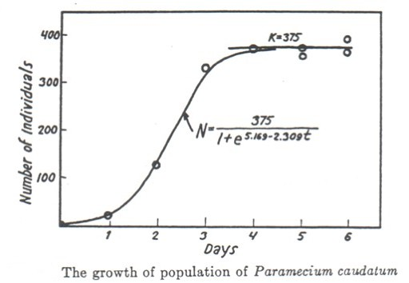

## The Natural Exponential

In previous examples, we evaluated exponentials with different bases that were variables (e.g. $x^5$) and rational numbers (e.g. $2^4$). 

Here, we'll learn about the *natural exponential*, $e$, which appears frequently in environmental science and modeling.

### First: $e$ is a number, not a variable: 2.71828182845904523536...

It is an irrational number, yes - meaning it can't be expressed by a simple ratio of integers - but a number nonetheless. With infinite decimal places.

It is always the same value.

---

## Where does $e$ come from?


- The value is from continuous compounding over infinite intervals: $e=\lim_{n\to\infty}(1+\frac{1}{n})^n$

- The **e** is from Leonard **Euler**, Swiss mathematician who proved the value was irrational

## Why is it so common?

- One reason: Exponential trends show up a LOT in environmental science (the proportional change is the same over each time span)

- Math reason: Turns out it's a very useful value for calculus

---

class: center, middle

```{r, echo = FALSE, out.width = "85%"}

```

---

class: center, middle

Gause, G. F. 1934. The Struggle for Existence. Baltimore: Williams and Wilkins.

```{r, echo = FALSE, out.width = "60%"}



```


---

## Logistic growth

$$N_t=\frac{K}{1+[\frac{K-N_0}{N_0}]e^{-rt}}$$

Where $N_t$ is the population size at time $t$, $K$ is the carrying capacity, $N_0$ is the initial population size, and $r$ is a growth rate.

### We should always think about *why an equations has the shape it has* - both conceptually and mathematically. 

---

$$N_t=\frac{K}{1+[\frac{K-N_0}{N_0}]e^{-rt}}$$

1. Why might we expect logistic growth for many populations? 

2. What variables *besides* time would influence the actual population?

3. Why, mathematically, does the logistic growth expression take the shape it does? What happens as the population becomes very close to the carrying capacity?

---

## Logarithms

Logarithms ask a question: $\log_a(b)$ asks "to what power do I have to raise $a$ to get a value of $b$?

For example: 

- $\log_2(8)$ asks "to what power do I have to raise 2, to get a value of 8?"

- $\log_3(100)$ asks "to what power do I have to raise 3, to get a value of 100?"

- $\log_x(x^{5.9})$ asks "to what power do I have to raise $x$ to get a value of $x^{5.9}$?"

- $\log_{banana}(banana^{1382.95})$ asks "to what power do I have to raise $banana$ to get a value of $banana^{1382.95}$?"

---

## Some log rules

- $\log_x(AB)=\log_x(A)+\log_x(B)$

- $\log_x(\frac{A}{B}) = \log_x(A)-\log_x(B)$

- $\log_x(A^B)=B\log_x(A)$

- $x^{\log_x(A)}=A$

- $\log_x(1)=0$

- $\log_x(x)= 1$

---

## The *natural log* = "log base $e$" = $\log_e()$ = $ln()$

So based on what we learned in the previous slide, what is:

- $\log_e(e^{10.4})$ = ?

- $\log_e(e^{2x+8.3})$ = ?

- $\log_e(e^{ax+2b^2-4.095})$ = ?

---

## Critical thinking questions

  1. Can the value within a $ln()$ expression ever be 0, or negative? Why?
  
  2. Can the solution to a natural log expression ever be negative? How?

---

## Working with $ln()$ and $e$ in equations

We can think of these as inverses of each other:

- $e^{\ln(x)} = x$

- $\ln(e^x)=x$

--

...and use that as a tool for escaping variables from exponents & logs (remembering we can do whatever we want to an equation, as long as we do **the same exact thing to both sides**):

- Find $x$ given $\ln(x) = 5$

  Exponentiate both sides: $e^{\ln(x)} = e^5$ ; simplify LHS to get: $x = e^5$

- Find $y$ given $e^{3y}=95$

  Take natural log of both sides: $\ln(e^{3y})=ln(95)$ ; simplifies to: $3y = \ln(95)$, so $y = \frac{\ln(95)}{3}$

---

## Graphs: visualizing & thinking about data

Graphs are a way for us to more easily process trends or patterns that may be more challenging to understand in a table or list. 

When you look at graphs, the first things you should ask: 

- What variables are plotted (e.g. x- & y-axis, including units)?
- What values are plotted (e.g. raw values, transformed, means, etc.)?
- What are the overall takeaways and am I understanding them responsibly?

---

## Practice saying these things OUT LOUD as if presenting the graph to an audienc

"This figure shows the [change/pattern/relationship] between [x-variable], shown on the x-axis in units of [units] and [y-variable], shown on the y-axis in units of [units]. Overall [overall statement of pattern / trend / findings]." 

Possibly with additional context as useful for the audience to put those findings into perspective (e.g. "this reduction represents an 82% decline in rainbowfish stocks along the Narnia Coast since 1991").

---

Graph interpretation example (Mono Lake)

---

Graph interpretation example (something else...)

---

## Slope (average)

Sometimes, it can be useful to find the *average rate of change* of a function. Between any two points on a function $(x_1,y_1)$ and $(x_2,y_2)$ the slope is found by:

$$m=\frac{\Delta y}{\Delta x}=\frac{y_2-y_1}{x_2-x_1}$$
---

## Get into the practice of saying the meaning out loud

- As if you're explaining it to someone unfamiliar with the data
- Including units
- Without overstating certainty 

For example, "Between 1972 and 2020 the price of hobbit homes increased by an average of $2,450 per year" **differs from** "Between 1972 and 2020 the price of hobbit homes increased by $2,450 per year." 


---

## Let's try it


---

## The *average* slope of a continuous function rarely tells the whole story

Can I find the **average** change in catch from 1984 - 2010? 

Mathematically, **yes**. Conceptually, **WHY**.

---

## Turns out a lot of things in environmental science are described by *rates*

---

## Data science vocabulary for the day

- Toolchain

- Back & front end

- Edge case

- Bork


