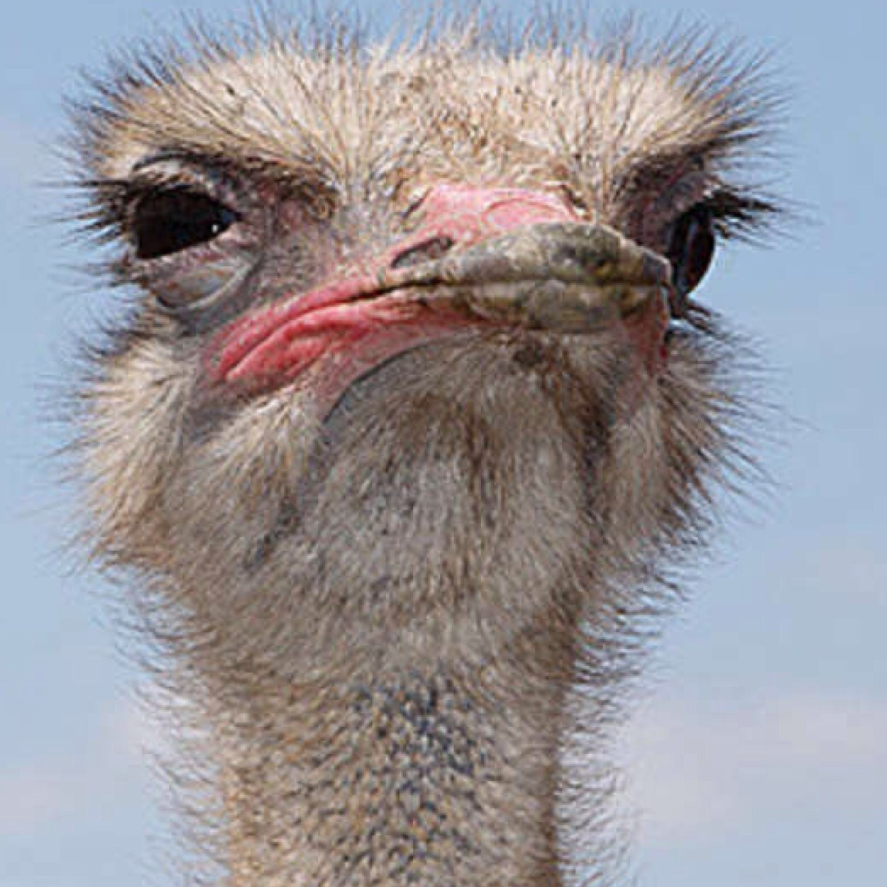

---

$$\frac{df}{dx}=\lim_{\Delta x\to 0}\frac{f(x+\Delta x)-f(x)}{\Delta x}$$
---

## Derivative of logs & exponents

- $\frac{d}{dx}(e^x) = e^x$

- $\frac{d}{dx}ln(x)=\frac{1}{x}$

---

## Applications 

- Minimum & maximum values (slope = 0)

- Increasing & decreasing functions (bounded by critical points)

- Describing rates of change is common in environmental science (rate of pollutant concentration change, rate of population growth, rate of energy consumption)

---

## Practice interpretation / math think

Imagine you have a bowl of soup and you want to describe how quickly it cools off. 

- What do you think is the *main driver* of cooling? 

- What if you have a hot plate? 

- What does this look like in an equation? 

---

## Newton's Law of Cooling

$$\frac{dT}{dt}=-k(T-T_a)+T_{in}$$
What do you think is wrapped up in $k$?

---

class: center, middle

# Higher order & partial derivatives

---

## Higher order derivatives

Higher order derivatives are derivatives of derivatives. 

### Notation

- First derivative: $f'(x)$ or $\frac{df}{dx}$
- Second derivative: $f''(x)$ or $\frac{d^2y}{dx^2}$
- Third derivative: $f'''(x)$ or $\frac{d^3y}{dx^3}$

---

### Higher order derivative example: 

Find the 3rd derivative of

$$G(z)=3z^4-8z^3+2z-19$$

$$G'(z)=\frac{dG}{dz}=12z^3-24z^2+2$$
$$G''(z)=\frac{d^2G}{dz^2}=36z^2-48z$$
$$G'''(z)=\frac{d^3G}{dz^3}=72z-48$$

---

## Partial derivatives

When we find a partial derivative, we find an expression for the slope with respect to *one variable* in a multivariate function.

**Mathematically**: Find the derivative with respect to a single variable, *treating all others as constants.* 

**Notation:** the partials of $f(x,y,z)$ are $\frac{\partial f}{\partial x}$, $\frac{\partial f}{\partial y}$, and $\frac{\partial f}{\partial z}$

---

## Partial derivatives example: 

Find all partials of: 
$$B(x,T,\rho)=0.4x^3T-3.6T^2+4\rho x$$

$$\frac{\partial B}{\partial x}=1.2Tx^2+4\rho$$
$$\frac{\partial B}{\partial T}=0.4x^3-7.2T$$
$$\frac{\partial B}{\partial \rho}=4x$$

---

### OK but what do partials actually mean?

The slope with respect to one variable if other variables are held constant. Let's think about a roller coaster. 

How can we describe our orientation? Let us count the ways...

[Commence drawing & handwaving extravaganza!]

---

## Let's try one

The temperature (in Celsius) across a surface (where x and y are in meters) is described by: 

$$T(x,y)=x^2y-2x+y-1$$
At what "rate" is temperature changing (with respect to distance):

- In the $x$ direction, at the point (1,3) on the surface?
- In the $y$ direction, at the point (0,2) on the surface?

---

## Another super real example

A dragon's breath temperature ($T$, in degrees Celsius) is modeled as a function of its wingspan ($W$, in meters) and length ($L$, also in meters): 

$$T(W,L)=0.41WL+2.6W^2$$
- At what rate is breath temperature changing with respect to length for a dragon that is 4.1m long, with a wingspan of 4.5m?

- At what rate is breath temperature changing with respect to wingspan, for the same dragon?

---

## Example: higher order & partial derivatives in environmental data science

The **Advection-Dispersion-Reaction Equation** for solute transport models the change in a solute concentration $C$ over time $t$, where groundwater is flowing in direction $x$:

$$\frac{\partial C}{\partial t}=D_x \frac{\partial^2C}{\partial x^2} + D_y\frac{\partial^2C}{\partial y^2}+D_z\frac{\partial^2C}{\partial z^2}-v\frac{\partial C}{\partial x}-\lambda RC$$

---

.center[

]

---

## Let's break it down. 

$$\frac{\partial C}{\partial t}=D_x \frac{\partial^2C}{\partial x^2} + D_y\frac{\partial^2C}{\partial y^2}+D_z\frac{\partial^2C}{\partial z^2}-v\frac{\partial C}{\partial x}-\lambda RC$$

- Left-hand-side: Rate of concentration change (over time)
- Right-hand-side first 3 terms: Concentration change due to dispersion in $x$, $y$, and $z$ directions
- Right-hand-side fourth term: Concentration change due to groundwater transport (in groundwater flow direction, x)
- Right-hand-side final term: Reaction term (e.g. biodegradation / abiotic degradation)

