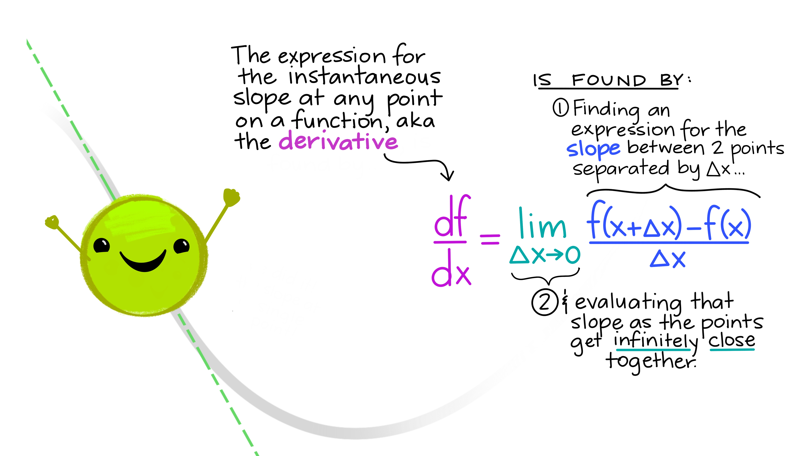

---

$$\frac{df}{dx}=\lim_{\Delta x\to 0}\frac{f(x+\Delta x)-f(x)}{\Delta x}$$
---

## Derivative of logs & exponents

- $\frac{d}{dx}(e^x) = e^x$

- $\frac{d}{dx}ln(x)=\frac{1}{x}$

---

## Applications 

- Minimum & maximum values (slope = 0)

- Increasing & decreasing functions (bounded by critical points)

- Describing rates of change is common in environmental science

---

class: center, middle

# Higher order & partial derivatives

---

## Higher order derivatives

Higher order derivatives are derivatives of derivatives. 

### Notation

- First derivative: $f'(x)$ or $\frac{df}{dx}$
- Second derivative: $f''(x)$ or $\frac{d^2y}{dx^2}$
- Third derivative: $f'''(x)$ or $\frac{d^3y}{dx^3}$

---

### Higher order derivative example: 

Find the 3rd derivative of

$$G(z)=3z^4-8z^3+2z-19$$

$$G'(z)=\frac{dG}{dz}=12z^3-24z^2+2$$
$$G''(z)=\frac{d^2G}{dz^2}=36z^2-48z$$
$$G'''(z)=\frac{d^3G}{dz^3}=72z-48$$

---

## Partial derivatives

When we find a partial derivative, we find an expression for the slope with respect to *one variable* in a multivariate function.

**Mathematically**: Find the derivative with respect to a single variable, *treating all others as constants.* 

**Notation:** the partials of $f(x,y,z)$ are $\frac{\partial f}{\partial x}$, $\frac{\partial f}{\partial y}$, and $\frac{\partial f}{\partial z}$

---

## Partial derivatives example: 

Find all partials of: 
$$B(x,T,\rho)=0.4x^3T-3.6T^2+4\rho x$$

$$\frac{\partial B}{\partial x}=1.2Tx^2+4\rho$$
$$\frac{\partial B}{\partial T}=0.4x^3-7.2T$$
$$\frac{\partial B}{\partial \rho}=4x$$

---

### OK but what do partials actually mean?

---

## Examples of higher order & partial derivatives in environmental data science

---

