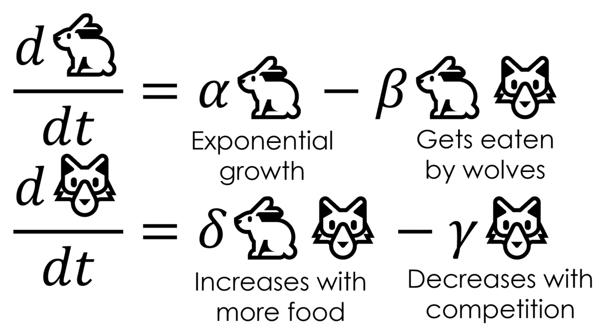
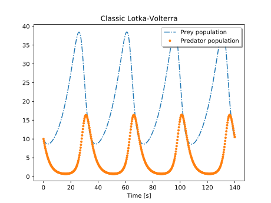

## Integration fundamentals - initial conditions for particular solutions

If your lemonade stand makes $200/yr, how much money do you make from your lemonade stand over 4 years? 

Do you know how much **total** money you have in your bank account from the information above? 

**Big takeaway:** We can know how much an amount *changes* without knowing the absolute amount in our bucket. But if we *want* to know the absolute amount, then we need an initial condition! 

---

## Integration blitz

**Integration:** A tool to get from rates back to amounts (e.g. $\frac{df}{dx}\rightarrow f(x)$)

We can think of it as *antiderivation*. 

- If $f(x)=x^2$, then $\frac{df}{dx}=2x$
- If $\frac{df}{dx} = 2x$, then $f(x)=?$

**Question:** if you don't know the original function and only have an expression for the rate (slope), then from the slope can you know the exact solution? 

---

## One rule for practice: the power rule for integration

$$\int{x^n}dx=\frac{x^{n+1}}{n+1} + C$$
#### Example: If $\frac{df}{dx}=3.8x^2-2.1$:

a) Find a general expression for $f(x)$

b) Given the initial condition $f(1.4)=5.9$, find the particular solution for $f(x)$

---

## Introduction to differential equations & solving them

A **differential equation** is an equation containing a differential expression. So it describes rates, often related to a function containing our variables of interest.

For example: 

$$\frac{df}{dt}=3.2-f(t)$$
is a differential equation because it contains both a the function $f(t)$ and it's derivative, $\frac{df}{dt}$.

---

## Differential equations: terms

- **Ordinary differential equation (ODE):** Does not contain partial derivatives

$$\frac{df}{dt}=3.2-f(t)$$

- **Partial differential equations (PDE):** Does contain partial derivatives 

$$\frac{\partial B}{\partial t}= \alpha B+0.31x-21.6$$
---

## Order of an ODE
- **Order:** The order of a differential equation is the highest order for any differential expression in the equation 

### Example: 
$\frac{df}{dt}=3.2-f(t)$ is a **first order ordinary differential equation** 

### Example: 
$\frac{\partial^3x}{\partial t^3}=2x-4.5\frac{\partial x}{\partial t}$ is a **third order partial differential equation**

---

## Practice: Use the terms from the previous slide to describe the following different equations

 $$\frac{\partial^2f }{\partial x^2}=1.4\times10^{-3}f(x)+5.2$$

$$2.9t^2 - \alpha B=\frac{dB}{dt}$$

$$\frac{dC}{dt}=4.1C-8.0$$

---

## Example: Lokta-Volterra (predator-prey) equations

$$\frac{dx}{dt}=\alpha x-\beta xy$$

$$\frac{dy}{dt}=\delta xy - \gamma y$$

Where: 

- $x$ is number of prey (e.g. rabbits)
- $y$ is number of predators (e.g. wolves)
- $\alpha, \beta, \gamma, \delta$ are positive parameters

---

## Thinking about differential equations: break it down

### Instantaneous rate of change in prey population size:

$$\frac{dx}{dt}=\alpha x-\beta xy$$
Where
 
- $x$ is number of prey (e.g. rabbits)
- $y$ is number of predators (e.g. wolves)
- $\alpha, \beta, \gamma, \delta$ are positive parameters

#### What do the different pieces of the equation *mean*?

---

## Interpretation of prey equation: 

$$\frac{dx}{dt}=\alpha x-\beta xy$$

The pieces: 

- $\frac{dx}{dt}$: Rate of growth / decline in prey abundance 
- $\alpha x$: Population growth (without loss due to predation)
- $-\beta xy$: Population loss (due to predation)

---

## Interpretation of predator equation

$$\frac{dy}{dt}=\delta xy - \gamma y$$

The pieces: 

- $\frac{dy}{dt}$: Rate of growth / decline in predator population
- $\delta xy$: Predator population growth
- $-\gamma y$: Predator population loss 

---

## Or, in pictures: 

From Christopher Rackauckas, [*Scientific machine learning: interpretable neural networks that accurately extrapolate from small data.*](https://www.stochasticlifestyle.com/how-to-train-interpretable-neural-networks-that-accurately-extrapolate-from-small-data/) from the Stochastic Lifestyle blog. 

.center[

---

## Finding $x(t)$ and $y(t)$?

Integration to find approximate solutions. *Image: [Modelica by Example](https://mbe.modelica.university/behavior/equations/population/)*

.center[

]
---

## Some differential equations can be solved analytically:

$$\frac{dy}{dx}=y$$

Separate variables and integrate both sides: 

$$\int\frac{1}{y}dy=\int1dx$$
Yielding: 

.center[
$ln(y)=x$ or $y=e^x$
]
---

### Numerical solutions versus analytical solutions

#### "Differential equations textbooks are cookbooks that give you lots of suggestions about approaches, but there are lots of differential equations (DEs) that simply don’t have analytic solutions — that is, solutions that you can write down. These equations can only be solved numerically..." 

.right[
\- *Dr. Liz Bradley (CS, University of Colorado)*
]

---

## Solving differential equations numerically

Find *approximate* solutions to differential equations when finding an analytical solution would be really challenging (...which is pretty often).

Instead, computers can numerically approximate solutions by predicting nearby values based on the *slope*. 

### There are many methods for solving differential equations numerically. Here we'll just get a little flavor. 

---

## The general process (many methods) exist

From the expression for *slope* and using an initial condition & parameter estimates, start at one endpoint and incrementally calculate values of the solution from the slope expression until reaching the other endpoint.

This means that the approximate solution is found by approximating values of the solution at equal intervals of the independent variable (often, time).

---

## Example: numerical approximation of DE solution

Let's say that we have a differential equation $\frac{dx}{dt}=2x+0.1$, and we don't know how to solve analytically for $x(t)$. Using the initial condition $x(0)=1$, let's numerically estimate the solution.

We'll create a table that estimates $x$ at increments of $t$ based on an approximation of the slope estimate $\frac{dx}{dt}$ . **WHAT?** It's OK, follow along.
 
(Aside: For a great example using the $\frac{dy}{dx}=y$ example above, see this [Khan Academy intro to the Euler method](https://www.khanacademy.org/math/ap-calculus-bc/bc-differential-equations-new/bc-7-5/v/eulers-method))

---

## Solving differential equations numerically in R

We'll use the `deSolve` package in R to help us. In our computing lab, we'll approximate and plot the Lokta-Volterra solutions! 

A great resource: [Solving Lokta-Volterra equations in R](https://rstudio-pubs-static.s3.amazonaws.com/32888_197d1a1896534397b67fb04e0d4899ae.html)

