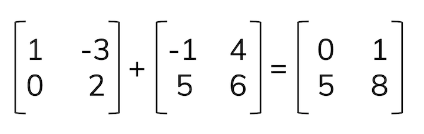
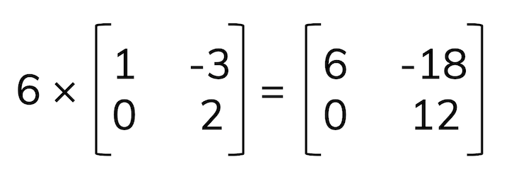
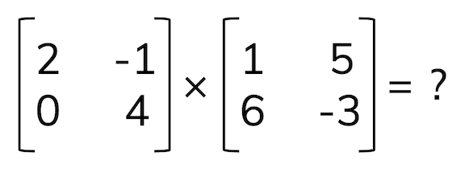
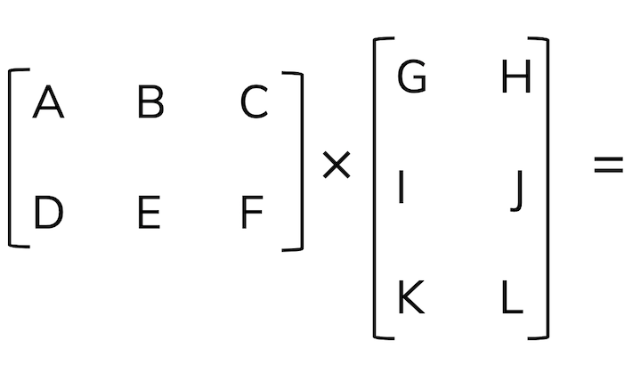
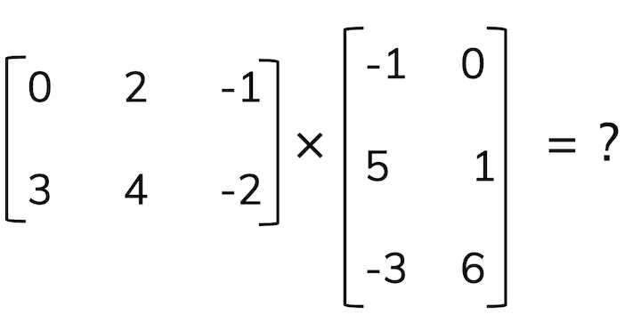
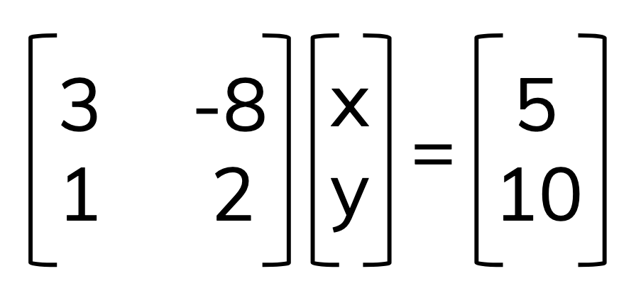

## Part 1: Linear algebra continued

- Refresher: vectors and working with them
- Matrices: notation, language, basic algebra
- Representing systems of equations with matrices
- Linear algebra in environmental science

---

## Matrices

A matrix is a table of values (multiple vectors in combination). A vector, therefore, can be thought of as a matrix with a single column. 

- Dimensions: the size of the matrix, in rows x columns (*m* x *n*)
- Elements: values in a matrix, often denoted symbolically with a subscript where the first number is the *row* and the second number is the *column* (e.g. $a_{34}$ indicates the element in row 3, column 4)

---

## Matrix algebra

### Addition & subtraction

Add or subtract the corresponding elements (by matrix position) to create a new matrix of the same dimensions. 

.center[

]

---

## Scalar multiplication

To multiply a matrix by a *scalar*, multiply each element in the matrix by the scalar to get a scaled matrix of the same dimensions.

For example: 

---

## Matrix multiplication

We find the *dot product* of row $\cdot$ column vectors:

---

## Practice problem:

---

## Critical thinking: Matrices with unequal dimensions

What do you think the output matrix would contain if you were multiplying the following? 

## Let's try one!

---

## Diagonal matrix

---

## Matrices as systems of equations

Often in environmental data science, we have multiple equations representing processes. Matrices give us a way to express these *systems of equations* in data structures that are easy to store and work with in data science. For example, let's say we have a system: 

$$3x-8y=5$$

$$x + 2y = 10$$

How can we write this using matrices? 

---

## Rewriting in matrix form:

$$3x-8y=5$$

$$x + 2y = 10$$

The matrix form of this system of equations looks as follows: 

.center[

]

---

## Examples: matrices and linear algebra in environmental science

---

---

---

exclude: true

## Vectors as scaled linear combinations of unit vectors

We can write vectors and linear combinations of scaled unit vectors, $\hat{i}$ and $\hat{j}$, which correspond to a vector of length 1 along the x and y axis, respectively. 

So, for example, the vector $\vec{u}=[4,7]$ can also be written as: 

$$\vec{u}=4\hat{i} + 7\hat{j}$$

