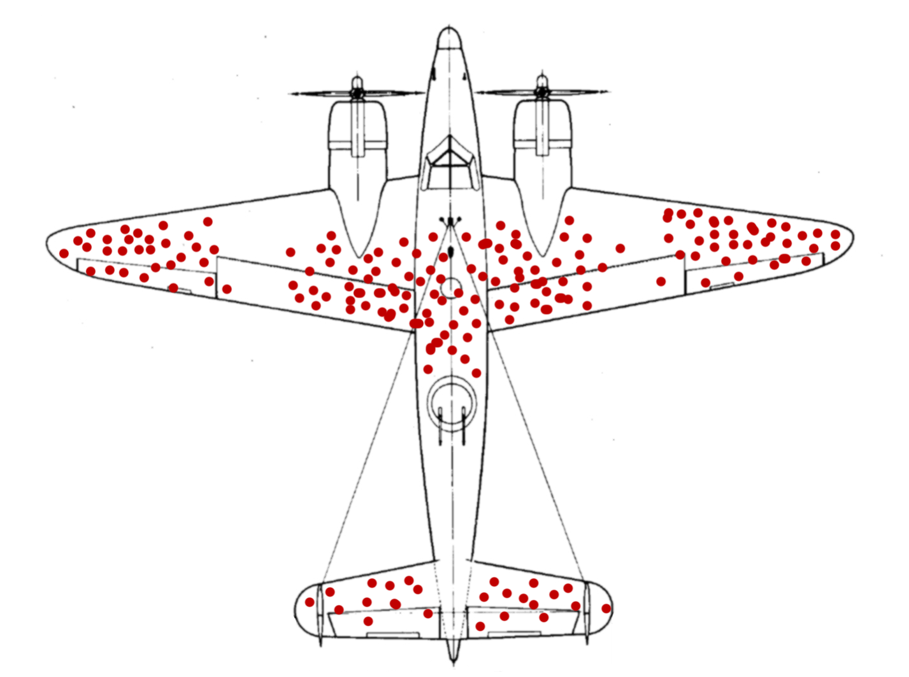

## A question needing rethinking: Abraham Wald's memo

.center[

]

---

## Hypothesis testing: building intuition

---

## Boolean algebra: a true & false world

Definition

---

In environmental data science

---

Basic Boolean operations

---

Secondary Boolean operations

---

Pseudocoding Boolean 

---

---
